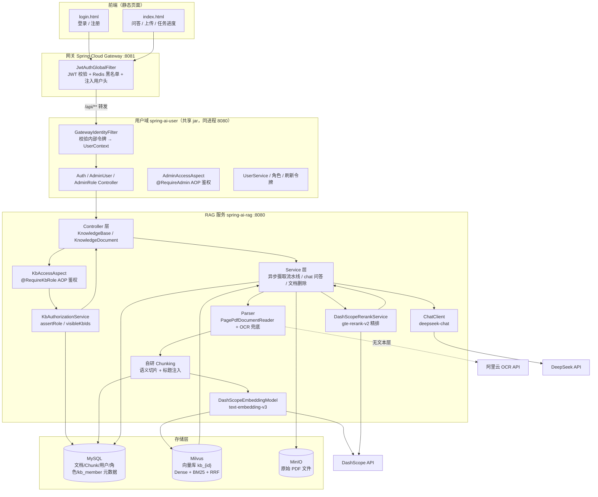

# Spring AI RAG Demo

一个基于 **Spring Boot 4 + Spring AI 2.0** 的企业级 **RAG（Retrieval-Augmented Generation，检索增强生成）** 演示项目。

项目将 PDF 文档解析、切分、向量化后存入 Milvus 向量数据库，问答时通过向量检索召回相关片段，作为上下文注入 DeepSeek 大模型生成回答，并附带可溯源的知识库引用。

---

## 目录

- [技术栈](#技术栈)
- [整体架构](#整体架构)
- [目录结构](#目录结构)
- [核心业务流程](#核心业务流程)
  - [1. 文档上传与摄取（Ingestion）](#1-文档上传与摄取ingestion)
  - [2. 知识问答（Q&A）](#2-知识问答qa)
  - [3. 文档删除](#3-文档删除)
  - [4. 用户认证与授权（JWT + RBAC）](#4-用户认证与授权jwt--rbac)
- [数据库设计](#数据库设计)
- [配置说明](#配置说明)
- [快速开始](#快速开始)
- [REST API 一览](#rest-api-一览)
- [关键设计决策](#关键设计决策)

---

## 技术栈

| 分类 | 技术 | 说明 |
|------|------|------|
| 框架 | Spring Boot 4.0.7 | 应用基础框架（Java 17） |
| AI 框架 | Spring AI 2.0.0 | 统一抽象 Chat / Embedding / VectorStore |
| 对话模型 | DeepSeek `deepseek-chat` | 问答生成模型 |
| 向量模型 | DashScope `text-embedding-v3`（1024 维） | 文本向量化（自研 `AbstractEmbeddingModel` 实现） |
| 重排序模型 | 百炼 `gte-rerank-v2` | 召回后精排（Cross-Encoder），提升上下文质量 |
| 向量数据库 | Milvus 2.6.0（SDK `milvus-sdk-java` 2.6.23） | 向量存储 + **BM25 全文检索（Hybrid Search，RRF 融合）** |
| 数据库 | MySQL 8.x + MyBatis-Plus 3.5.16 | 元数据 / 用户 / chunk 文本持久化 |
| 对象存储 | MinIO 8.5.12 | 原始文档文件存储（同时支持本地磁盘模式） |
| 认证/授权 | JWT（jjwt 0.12.6）+ BCrypt + RBAC | 无状态登录认证 + 知识库数据权限（防越权）；用户域独立为 `spring-ai-user` 共享 jar（同进程部署），Token 校验集中到网关，RAG 侧仅校验内部信任令牌 |
| 网关 | Spring Cloud Gateway 2025.0.0（gateway-server 4.3.0） | 统一入口（8081）：路由 `/api/**`、JWT 校验、Redis 黑名单、CORS、访问日志、可选 IP 限流 |
| PDF 解析 | Spring AI `PagePdfDocumentReader` | 按页解析 PDF（文本层） |
| OCR | 阿里云 OCR（`ocr_api20210707` SDK） | 扫描版 PDF（无文本层）自动识别文字 |
| 前端 | 原生 HTML / CSS / JS | `login.html` + `index.html` 静态页面（页面由 8080 提供，接口统一走 8081） |

---

## 整体架构



**模型分工（Bean 显式限定避免歧义）：**

| 角色 | 模型 | 提供商 | Bean 名 |
|------|------|--------|---------|
| 对话 / 生成 | `deepseek-chat` | DeepSeek API | `deepSeekChatModel` |
| 向量化 | `text-embedding-v3` | DashScope（阿里云） | 自定义 `DashScopeEmbeddingModel` |
| 召回重排序 | `gte-rerank-v2` | 百炼（DashScope） | 自定义 `DashScopeRerankService` |
| 图片文字识别 | 阿里云 OCR `RecognizeAllText` | 阿里云 OCR | 自定义 `AliyunOcrService` |

> Spring AI 2.0 未内置 DashScope Embedding Starter，项目自研了 `DashScopeEmbeddingModel`（继承 `AbstractEmbeddingModel`），直接调用 DashScope REST API，输出 1024 维向量。Rerank 复用同一 DashScope API Key。

---

## 目录结构

```
spring-ai-rag-demo/
├── docker/
│   └── docker-compose.yml          # Milvus(含 etcd/attu) + MinIO 编排
├── logs/                           # 运行日志
├── pom.xml                         # 聚合父 POM（Java 17，依赖/版本管理）
├── mvnw / mvnw.cmd                 # Maven Wrapper
├── spring-ai-rag/                  # RAG 服务核心模块（业务代码）
│   ├── pom.xml                     # 依赖 com.example:spring-ai-user（用户域共享 jar）
│   └── src/
│       ├── main/
│       │   └── java/com/example/springairagdemo/
│       │       ├── SpringAiRagDemoApplication.java # @SpringBootApplication(scanBasePackages 双包)
│       │       ├── config/
│       │       │   ├── AiConfig.java                  # ChatClient / 模型装配
│       │       │   ├── MilvusConfig.java              # Milvus 客户端
│       │       │   ├── RagConfigProperties.java       # rag.* 配置绑定（含 batch-size）
│       │       │   ├── AsyncTaskConfig.java           # Embedding 异步任务线程池（taskExecutor）
│       │       │   ├── AsyncTaskProperties.java       # 线程池参数绑定（spring.task.embedding.*）
│       │       │   ├── NamedThreadFactory.java        # rag-embedding-N 线程命名
│       │       │   ├── DataSourceConfig.java          # HikariCP 连接池显式装配
│       │       │   ├── DatabasePoolProperties.java    # 连接池参数绑定（spring.datasource.pool.*）
│       │       │   ├── DataInitializer.java           # 启动初始化（恢复中断任务）
│       │       │   └── GlobalExceptionHandler.java    # 全局异常 → 统一 JSON
│       │       ├── controller/
│       │       │   ├── KnowledgeBaseController.java   # 知识库管理 + 成员授权
│       │       │   └── KnowledgeDocumentController.java # 上传/任务轮询/问答/删除/下载
│       │       ├── security/                          # 防越权（知识库数据授权）
│       │       │   ├── KbRole.java                    # 知识库角色枚举 VIEWER < EDITOR < OWNER
│       │       │   ├── RequireKbRole.java             # 知识库角色注解（方法级）
│       │       │   └── KbAccessAspect.java            # @RequireKbRole AOP 切面
│       │       ├── embedding/
│       │       │   └── DashScopeEmbeddingModel.java   # 自研 DashScope 向量模型
│       │       ├── entity/                            # MyBatis-Plus 实体 + 枚举
│       │       │   ├── KnowledgeBaseEntity.java
│       │       │   ├── KnowledgeDocumentEntity.java   # 含 version / status(7态) / expire_time
│       │       │   ├── KnowledgeChunkEntity.java
│       │       │   ├── KnowledgeEmbeddingTaskEntity.java # 任务 + 5 个阶段进度字段
│       │       │   ├── DocumentStatus.java            # 文档状态枚举（0上传中~6已过期）
│       │       │   ├── KnowledgeEmbeddingTaskStatus.java # 任务状态枚举（0待处理~3失败）
│       │       │   ├── KbMemberEntity.java            # 知识库成员授权（数据权限）
│       │       │   └── KbAccessLogEntity.java         # 访问审计日志
│       │       ├── mapper/                            # MyBatis-Plus Mapper
│       │       │   ├── KnowledgeBaseMapper.java
│       │       │   ├── KnowledgeDocumentMapper.java
│       │       │   ├── KnowledgeChunkMapper.java
│       │       │   ├── KnowledgeEmbeddingTaskMapper.java
│       │       │   ├── KbMemberMapper.java
│       │       │   └── KbAccessLogMapper.java
│       │       ├── parser/
│       │       │   ├── DocumentParser.java             # 解析接口
│       │       │   ├── PdfDocumentParser.java          # PDF 解析实现（含 OCR 兜底）
│       │       │   ├── HeadingExtractor.java           # 标题行识别 / 标题链构建
│       │       │   └── SemanticSplitter.java           # 语义切片（段落聚类 + 断点）
│       │       └── service/
│       │           ├── KnowledgeDocumentService.java   # 摄取异步流水线 + 问答（抽象类）
│       │           ├── PdfKnowledgeDocumentServiceImpl.java # PDF 摄取实现
│       │           ├── VectorStoreService.java         # Milvus 增删查（embedChunks / upsertVectors）
│       │           ├── HybridSearchService.java        # 混合检索编排（RRF 融合 + 异常降级）
│       │           ├── RerankService.java / DashScopeRerankService.java   # 重排序接口与实现
│       │           ├── OcrService.java / AliyunOcrService.java            # OCR 接口与实现
│       │           ├── FileStorageService.java / MinioFileStorageService.java / LocalFileStorageService.java
│       │           ├── KnowledgeEmbeddingTaskService.java # 任务服务（提交/进度/恢复）
│       │           ├── KnowledgeBaseService.java       # 知识库服务接口
│       │           ├── KnowledgeDocumentEntityService.java
│       │           ├── KnowledgeChunkEntityService.java
│       │           ├── KbAuthorizationService.java     # 权限判定中枢（assertRole/visibleKbIds/授权）
│       │           ├── KbMemberService.java / KbAccessLogService.java
│       │           ├── KbMemberDeletionGuard.java      # SPI：删用户前最后所有者保护 + 清理 kb_member
│       │           ├── KbAccessLogAuditHandler.java    # SPI：用户域管理操作审计落库 kb_access_log
│       │           └── impl/                           # Service 实现类
│       └── resources/
│           ├── application.yaml                        # 全局配置
│           └── static/
│               ├── login.html                          # 登录/注册页
│               └── index.html                          # 问答/上传/任务分阶段进度仪表盘
├── spring-ai-user/                 # 用户域共享模块（library jar，被 RAG 依赖、同进程 8080 部署）
│   ├── pom.xml                     # 用户域模块 POM（包 com.example.user）
│   └── src/
│       └── main/
│           └── java/com/example/user/
│               ├── config/                             # JWT 与内部信任令牌
│               │   ├── JwtUtil.java                    # JWT 生成/解析
│               │   ├── JwtConfig.java                  # JWT 配置属性（注册 GatewayIdentityFilter）
│               │   └── GatewayIdentityFilter.java      # 校验网关内部令牌并注入登录态（UserContext）
│               ├── controller/
│               │   ├── AuthController.java             # 注册/登录/登出/当前用户/用户搜索
│               │   ├── AdminUserController.java        # 系统管理-用户（需 ADMIN，经 SPI 联动业务域）
│               │   └── AdminRoleController.java        # 系统管理-角色（需 ADMIN）
│               ├── security/                           # 认证上下文 + ADMIN 切面
│               │   ├── LoginUser.java                  # 登录用户模型（id/username/nickname）
│               │   ├── UserContext.java                # ThreadLocal 当前用户上下文
│               │   ├── ForbiddenException.java         # 403 业务异常
│               │   ├── RequireAdmin.java               # ADMIN 功能角色注解（方法级）
│               │   └── AdminAccessAspect.java          # @RequireAdmin AOP 切面
│               ├── entity/                             # 用户域实体
│               │   ├── UserEntity.java
│               │   ├── SysRoleEntity.java              # RBAC 功能角色
│               │   └── SysUserRoleEntity.java          # 用户-角色关联
│               ├── mapper/
│               │   ├── UserMapper.java
│               │   ├── SysRoleMapper.java
│               │   └── SysUserRoleMapper.java
│               ├── service/
│               │   ├── UserService.java                # 注册/登录/删除用户/isAdmin（JWT + BCrypt）
│               │   ├── SysRoleService.java / SysUserRoleService.java
│               │   ├── RedisRefreshTokenService.java   # 刷新令牌 + 登出黑名单
│               │   └── UserDataInitializer.java        # 启动初始化（ADMIN 角色/默认账号）
│               └── spi/                                # 扩展点（业务域实现，用户域只依赖接口）
│                   ├── UserDeletionGuard.java          # 删除用户前钩子（RAG 侧实现：清理 kb_member）
│                   └── UserAdminAuditHandler.java      # 用户管理操作审计钩子（RAG 侧实现：落库 kb_access_log）
├── gateway/                        # 网关子模块（Spring Cloud Gateway，端口 8081）
│   ├── pom.xml                     # 继承父 POM + spring-cloud-dependencies BOM + jjwt 0.12.6
│   └── src/
│       ├── main/
│       │   ├── java/com/example/gateway/
│       │   │   ├── GatewayApplication.java    # 启动类 + IP 限流 KeyResolver
│       │   │   ├── security/JwtUtil.java      # JWT 校验工具（secret 与 RAG 共享一致）
│       │   │   └── filter/
│       │   │       ├── JwtAuthGlobalFilter.java # 全局认证过滤器（白名单/黑名单/注入用户头）
│       │   │       └── LoggingGlobalFilter.java # 全局访问日志过滤器
│       │   └── resources/
│       │       └── application.yaml          # 路由 / CORS / jwt.secret / Redis / 可选 IP 限流
│       └── test/
├── sql/
│   └── init.sql                              # 全量初始化脚本（业务表 + RBAC 权限表 + 内置角色/账号）
```

---

## 核心业务流程

### 1. 文档上传与摄取（异步任务流水线）

摄取采用**异步任务制**：`submitIngest` 快速返回 `taskNo`，实际处理在自定义线程池（`rag-embedding-N`）中执行 `processTaskAsync`。入口先执行 `assertRole(kbId, EDITOR)` 权限校验（需 EDITOR 及以上）。

文档状态机（`status`，7 态）：

```
 0 UPLOADING ──→ 1 PARSING ──→ 2 EMBEDDING ──→ 3 SUCCESS
     上传中         解析中         向量化中         成功
                    │                              │
                    │                              ├─→ 5 DEPRECATED（被新版顶替，TTL 内仍可检索）
                    │                              │       └─→ 6 EXPIRED（TTL 到期懒标记过滤）
                    └─→ 4 FAILED（失败，保留半成品供增量恢复）
```

```
上传 PDF（multipart）
  │
  ├─ ① 提交阶段（submitIngest，接口立即返回 taskNo）
  │       · saveDocumentInfo   写入 MySQL knowledge_document
  │           - 同知识库同名文件 → 自动推断递增版本号 v1/v2/v3...
  │             （版本号取同名文档全部状态中的最大版本 +1，防重号）
  │           - 状态置 0（UPLOADING 上传中）
  │       · persistUploadedFile 最先持久化原始文件（MinIO/本地），失败可恢复
  │           - 路径规则：{知识库id}/{年/月/日}/{文档id}_{清洗文件名}.pdf
  │       · 创建 Embedding 任务（status=0 待处理），提交线程池执行
  │       · 提交阶段失败 → 补偿删除文件 + document/task 记录（防孤儿）
  │
  └─ ② 异步处理（processTaskAsync，任务状态 0待处理→1处理中→2成功/3失败）
        │  文档状态 0上传中 → 1解析中 → 2向量化中 → 3成功 / 4失败
        │
        ├─ 解析       PagePdfDocumentReader 按页解析（无文本层 OCR 兜底）
        │             → parse_progress = 100%
        ├─ 切分       SemanticSplitter：语义切片 + 标题感知注入
        │             · 段落批量 embedding 聚类 → 相邻相似度 < 0.55 处断点
        │             · 标题链注入（如 "3 考勤制度 > 3.2 请假流程"）写 metadata.heading
        │             · 超长段 token 二次切分；失败自动降级 TokenTextSplitter
        │             · 默认 chunk-size 800、min 350 字符、最大 10000 chunk
        │             → split_progress = 100%
        ├─ 增量分类    与已有 chunk 对比（chunk_index + content_hash）
        │             toSave(新增/变化) / toVectorOnly(缺向量) / skip(已完整) / stale(删除)
        ├─ Chunk 入库  saveBatch 批量写 MySQL knowledge_chunk（主键回填）
        │             → chunk_progress = 100%
        ├─ Embedding  按 batch-size 分批向量化（embed_progress 0→100%，逐批回写）
        ├─ Milvus     按 batch-size 分批 upsert 到 kb_{id}（milvus_progress 0→100%）
        │             · 回填 milvus_id：作为"向量已写入"的增量判定标记
        │             · 每批更新任务 success_chunk，前端 5 行进度条实时展示
        ├─ 置成功      文档状态 3（SUCCESS），回填 chunk_count
        └─ 旧版下线    deprecateOldVersions：同名旧版置 5（DEPRECATED）+ 设 expire_time
                      （TTL 默认 30 天，到期后懒标记为 6 EXPIRED 并过滤）
```

**失败兜底（增量执行，不整批回滚）：**
- 任何步骤异常 → 任务标记失败（status=3），文档置 4（FAILED），记录 error_message；
- 半成品保留：已写 MySQL chunk / 已写 Milvus 向量按 `milvus_id` 判空标记，作为恢复线索；
- 重启恢复：启动时扫描中断任务 → 重新入队增量补齐（解析/切分/embedding 幂等，仅处理未回填 milvus_id 的 chunk）。

### 2. 知识问答（Q&A）

`KnowledgeDocumentService.chat(question, knowledgeBaseId)`（入口先执行 `assertRole(kbId, VIEWER)`，需 VIEWER 及以上）：

```
用户问题
  │
  ├─ ① 检索召回   Hybrid Search：问题 → DashScope 向量化（Dense 路）+ 关键词全文（BM25 路），
  │       Milvus 端 RRF 融合，召回 candidateTopK=20 候选
  │       · rag.hybrid.enabled=false 时降级为纯向量相似度检索（阈值 0.3）
  │
  ├─ ② 过滤       状态白名单：仅 SUCCESS(3) / DEPRECATED(5) 参与问答（排除处理中/失败/过期）
  │       · 懒标记过期：chat 开头将 TTL 到期的旧版本标记为 EXPIRED(6) 并过滤
  │       · 同名多版本只保留版本号最高的检索结果（新版优先，防止新旧混召）
  │
  ├─ ③ 取回文本   按 chunk_id 从 MySQL 回查完整 chunk 内容
  │
  ├─ ④ Rerank 精排 百炼 gte-rerank 对 "问题 vs 候选" 逐对打分，
  │       按相关性降序取 topN=5（失败自动降级为向量排序）
  │
  ├─ ⑤ 组装上下文 按精排顺序拼接，标注 [来源n] 文档名 + 页码
  │
  ├─ ⑥ LLM 生成   上下文注入系统提示词（仅依据知识库回答），DeepSeek 生成答案
  │
  └─ ⑦ 来源溯源   从回答中正则提取实际引用的 [来源n]，返回精准来源列表
```

**检索增强说明**：采用"先宽后精"的两阶段检索——**混合检索**（Dense 语义向量 + BM25 全文关键词双路召回，RRF 融合）召回较多候选（默认 20），再由专门的 Cross-Encoder 重排序模型精排取前 5，显著优于纯向量 top-5。BM25 路能召回向量路遗漏的"关键词精确命中"片段，对专有名词、编号、缩写类问题尤其有效。

**返回结构**：`{ answer, sources: [{documentId, documentName, pageNo, snippet}] }`
前端可将 `sources` 渲染为可下载/可跳转的引用来源。

### 3. 文档删除

`KnowledgeDocumentService.deleteDocument(documentId)` 三存储独立容错（对象级权限：先按文档 ID 查所属知识库，再 `assertRole(kbId, EDITOR)` 校验）：

1. MySQL：删除 `knowledge_chunk` + `knowledge_document`（同事务，原子性）
2. MinIO：删除原始文件（异常仅记日志，不阻断）
3. Milvus：按文档 ID 删除向量（异常仅记日志，不阻断）

### 4. 用户认证与授权（JWT + RBAC）

**认证**（识别"你是谁"）：

注册/登录由**用户域模块 `spring-ai-user`**（共享 jar，与 RAG 服务同进程部署于 8080）签发 JWT（`UserService`：BCrypt 校验密码、签发 Access Token、刷新/登出维护 Redis 黑名单），此后所有 `/api/**` 请求统一经网关 8081 进入：

```
访问  /api/**            请求头携带 Authorization: Bearer <token>（页面从 8080 加载，接口走 8081）
                            ↓
              网关 JwtAuthGlobalFilter（8081，GlobalFilter order=-200）
              · 白名单放行：/api/register、/api/login、/api/logout、/api/refresh
              · 校验 Token 签名与有效期（jjwt，secret 与 RAG 完全一致）
              · 查 Redis 黑名单（登出/刷新后旧 Token 立即失效）
              · 注入 X-User-Id / X-Username / X-Gateway-Token 后转发
                            ↓
              用户域 GatewayIdentityFilter（spring-ai-user，8080）
              · 校验 X-Gateway-Token（内部信任令牌，防绕过网关直连伪造身份）
              · 构造 LoginUser → UserContext.set() → 进入业务鉴权（RBAC / kb_member）
              · 请求结束 finally 中 UserContext.clear()
```

**授权**（判定"你能做什么"）——纵深防御三层：

```
① 注解式入口校验（AOP）
   @RequireKbRole(EDITOR) 等标注在 Controller 方法上
   KbAccessAspect 自动从方法参数解析 kbId（参数名 / 唯一 Number / JSON body）
   → KbAuthorizationService.assertRole(kbId, role)

② Service 层守卫（核心业务兜底）
   submitIngest() → assertRole(kbId, EDITOR)  # 上传文档
   chat()    → assertRole(kbId, VIEWER)   # 问答检索
   deleteDocument() → 对象级：先查文档所属 kbId 再校验

③ 数据源头过滤（防泄露）
   list / knowledge-bases 强制按「当前用户可见知识库集合」过滤
   download/delete 为对象级安全：先 getDocument() 取 kbId 再校验
```

**角色模型（双层权限）：**

- **垂直权限（RBAC）**：`sys_user_role` 关联全局角色，`ADMIN` 为超级管理员，放行全部操作（不参与 kb_member 判定）。
- **水平权限（数据授权）**：`kb_member` 记录"用户 × 知识库 × 角色"，是知识库访问的唯一权威。

| 角色 | 级别 | 权限 |
|------|------|------|
| `ADMIN` | 全局 | 全部操作（不看 kb_member） |
| `OWNER` | 4 | 管理/删除/授权成员 + 上传/编辑 + 查看检索 |
| `EDITOR` | 3 | 上传/编辑文档 + 查看检索 |
| `VIEWER` | 2 | 仅查看/检索/下载 |

安全特性：
- **创建人强制**：创建知识库时 `createUser` 取自登录态（不信任前端传参），创建者自动成为 OWNER；
- **最后一个 OWNER 保护**：移除成员时不允许移除知识库最后一名 OWNER；
- **AOP 自动解析 kbId**：无需手工写重复鉴权代码；
- **统一 403**：`GlobalExceptionHandler` 将 `ForbiddenException` 转为 `{success:false, code:403}`；
- **审计日志**：`kb_access_log` 记录关键访问行为；
- 默认初始化 `ADMIN` 角色 + `admin/admin123` 账号（见用户域 `UserDataInitializer`）。

**权限管理（系统管理模块，仅 ADMIN 可见）：**

- **用户管理**：用户列表（含功能角色标签）/ 创建用户 / 启用禁用 / 重置密码 / 删除（自动清理角色与数据授权）；
- **角色管理**：角色列表（含用户数）/ 创建角色 / 删除角色（内置 `ADMIN` 不可删除）；
- **分配功能角色**：在用户列表中对指定用户勾选角色（`sys_user_role` 覆盖式重写），并保护"最后一个 ADMIN"不会被降权/禁用/删除；
- **数据权限**：知识库列表每行「成员」按钮 → 搜索用户 + 选择 `VIEWER/EDITOR/OWNER` 授权，可移除成员（最后一个 OWNER 保护）。

前端 `index.html` 通过 `fetchApi()` 统一在请求头注入 Token，登出时清除 `localStorage`；`/api/user` 返回 `isAdmin`，据此控制「系统管理」菜单显隐。

---

## 数据库设计

初始化脚本：
- `sql/init.sql` — 全量初始化脚本（需手动在 MySQL 执行一次）：
  业务表 `knowledge_base` / `knowledge_document` / `knowledge_chunk` / `knowledge_embedding_task`，权限表 `sys_user` / `sys_role` / `sys_user_role` / `kb_member` / `kb_access_log`，以及内置 `ADMIN` 角色与 `admin` 账号（均幂等，可重复执行）。
  应用启动时用户域 `UserDataInitializer` 也会自动补齐 `ADMIN` 角色与默认账号（仅当 `sys_user` 表为空时）。

| 表 | 用途 | 关键字段 |
|----|------|----------|
| `knowledge_base` | 知识库 | name(唯一)、description、status、create_user |
| `knowledge_document` | 文档元数据 | knowledge_id(FK)、file_name、file_path、file_size、file_type、chunk_count、embedding_model、status(**0上传中/1解析中/2向量化中/3成功/4失败/5已废弃/6已过期**)、**version**、**expire_time**（旧版本下线时间）、**is_active** |
| `knowledge_chunk` | 文本分块 | document_id(FK)、chunk_index、content(LONGTEXT)、content_hash(SHA-256)、token_count、page_no、milvus_id |
| `knowledge_embedding_task` | 向量化任务 | task_no(唯一)、document_id(FK)、status(0待处理/1处理中/2成功/3失败)、total/success/fail_chunk、**parse/split/chunk/embed/milvus_progress（阶段进度 0-100）**、retry_count、error_message、cost_time |
| `sys_user` | 系统用户 | username(唯一)、password(BCrypt)、nickname、email、status |
| `sys_role` | 全局角色（RBAC） | role_code(唯一)、role_name、description |
| `sys_user_role` | 用户-角色关联 | user_id(FK)、role_id(FK) |
| `kb_member` | 知识库成员授权（数据权限） | knowledge_id(FK)、user_id(FK)、role(VIEWER/EDITOR/OWNER)、create_time |
| `kb_access_log` | 访问审计日志 | user_id、knowledge_id、action、ip、create_time |

---

## 配置说明

`application.yaml` 关键配置：

| 配置项 | 说明 |
|--------|------|
| `spring.ai.deepseek.*` | DeepSeek base-url / 模型 / 温度（api-key 从环境变量 `DEEPSEEK_API_KEY` 读取） |
| `spring.ai.dashscope.*` | DashScope embedding 模型（api-key 从环境变量 `DASHSCOPE_API_KEY` 读取） |
| `spring.ai.vectorstore.milvus.*` | Milvus 连接、索引类型（IVF_FLAT/COSINE）、维度 1024 |
| `spring.datasource.*` | MySQL 连接（`knowledge_base` 库） |
| `spring.datasource.pool.*` | HikariCP 连接池（max/min/空闲/超时/存活等，默认 max=50） |
| `spring.task.embedding.*` | 摄取异步任务线程池（core=2/max=4/queue=100/命名 rag-embedding-N/CallerRuns 饱和策略/优雅停机等待） |
| `rag.storage.type` | `minio` / `local` 文件存储切换 |
| `rag.storage.minio.*` | MinIO endpoint / 密钥 / bucket |
| `rag.document.version-ttl-days` | 旧版本文档共存天数（默认 30） |
| `rag.document.upload-dir` | 本地存储模式上传目录 |
| `rag.document.batch-size` | 向量化批处理大小（默认 100：每批 = 一次 embedding 批量调用 + 一次 Milvus upsert + 一次进度回写，降低超大文档内存/超时风险） |
| `rag.document.chunk.*` | 全局文档分块参数（chunk-size、heading、semantic 等，见下表） |
| `rag.rerank.enabled` | 是否启用召回重排序（默认 true） |
| `rag.rerank.model` | 重排序模型（默认 `gte-rerank-v2`） |
| `rag.rerank.candidate-top-k` | 向量召回候选数（默认 20） |
| `rag.rerank.top-n` | 精排后保留片段数（默认 5） |
| `rag.rerank.threshold` | 向量召回相似度阈值（默认 0.3） |
| `rag.rerank.fallback-on-error` | Rerank 失败时降级为纯向量排序（默认 true） |
| `rag.hybrid.enabled` | 是否启用混合检索（Dense + BM25 + RRF，默认 true；false=纯向量） |
| `rag.hybrid.route-top-k` | 每路（dense / bm25）召回候选数（默认 40，融合取 rerank.candidate-top-k 条） |
| `rag.hybrid.min-score` | 融合结果最低 RRF 分数，低于该值视为噪声（默认 0 不启用过滤） |
| `rag.hybrid.rrf-k` | RRF 平滑系数 k（默认 60，score = Σ 1/(k + rank)） |
| `rag.hybrid.fallback-on-error` | Hybrid 检索异常时降级为纯向量检索（默认 true） |
| `rag.ocr.enabled` | 是否启用 OCR（默认 true） |
| `rag.ocr.region-id` | OCR 服务地域（默认 cn-hangzhou） |
| `rag.ocr.access-key-id/secret` | 阿里云 AccessKey（建议环境变量 `ALIYUN_OCR_AK/SK`） |
| `rag.ocr.dpi` | PDF 页渲染分辨率（默认 200） |
| `rag.ocr.min-text-length` | 页文本低于该长度触发 OCR（默认 20） |
| `rag.document.chunk.heading.enabled` | 标题感知切分开关（默认 true） |
| `rag.document.chunk.heading.max-depth` | 标题链最大深度（默认 3） |
| `rag.document.chunk.heading.max-length` | 标题行最大字符数（默认 40） |
| `rag.document.chunk.heading.prefix-template` | 标题前缀注入模板（默认 `【{heading}】`） |
| `rag.document.chunk.semantic.enabled` | 语义切片开关（默认 true） |
| `rag.document.chunk.semantic.threshold` | 相邻段落相似度断点阈值（默认 0.55） |
| `rag.document.chunk.semantic.batch-size` | 段落 embedding 批量大小（默认 10） |
| `rag.document.chunk.semantic.fallback-on-error` | 语义切片失败降级 token 切分（默认 true） |
| `jwt.secret` / `jwt.expiration-ms` | JWT 密钥（≥32 字节）与过期时间（**必须与 gateway 模块完全一致**，否则网关无法校验签名） |
| `gateway.internal-token` | 网关内部信任令牌（`X-Gateway-Token`），用户域 `GatewayIdentityFilter` 校验，防绕过网关直连伪造身份 |

**gateway 模块（`gateway/src/main/resources/application.yaml`）关键配置：**

| 配置项 | 说明 |
|--------|------|
| `spring.cloud.gateway.server.webflux.routes` | 路由：`/api/**` → `http://localhost:8080`（RAG 服务） |
| `spring.cloud.gateway.server.webflux.globalcors` | 跨域：放行所有来源（页面从 8080 加载、接口走 8081） |
| `jwt.secret` / `jwt.expiration-ms` | 与 RAG 模块一致（网关侧仅校验、不签发） |
| `spring.data.redis.*` | 与 RAG 同一 Redis 实例（Token 黑名单） |
| `gateway.internal-token` | 与 RAG 模块一致的内部信任令牌 |

> 注意：Spring Cloud 2025.0 起 `spring.cloud.gateway.*` 配置前缀已废弃，网关配置统一使用 `spring.cloud.gateway.server.webflux.*`。
> Rerank 复用 `spring.ai.dashscope.api-key`，无需单独配置 key；
> OCR 需在阿里云开通"文字识别 OCR"服务，并配置 AccessKey（建议用环境变量注入）；
> 语义切片复用 `DashScopeEmbeddingModel`（text-embedding-v3），每篇文档按段落批量向量化一次（价格极低），失败自动降级为 TokenTextSplitter。

> 注意：所有大模型 Key（DeepSeek / DashScope）均已从环境变量读取，`application.yaml` 中不再含明文密钥，可安全提交到仓库。
> Hybrid Search 依赖 Milvus 服务端 2.5+ 的 BM25 稀疏向量与内置 analyzer；项目通过 pom 的 `milvus-sdk.version`（2.6.23）覆盖 Spring AI 传递引入的旧版 SDK（2.5.8，仅 v1 客户端、不支持 BM25）。

---

## 快速开始

### 1. 启动基础服务（Docker）

```bash
cd docker
docker-compose up -d
```

会启动：Milvus 2.6.0（+ etcd）、MinIO（9002/9003，bucket `knowledge-documents` 自动创建）、Attu 管理界面（http://localhost:8000）。

> 仓库中的 compose 未包含 MySQL 服务，需自行准备 MySQL 8.x，并执行一次：
> 1. `sql/init.sql` — 全量初始化：业务表 + 权限表 + 内置 `ADMIN` 角色与 `admin` 账号（幂等，可重复执行）。

### 1.1 默认账号

应用启动时用户域 `UserDataInitializer` 会自动初始化 `ADMIN` 角色及超级管理员账号：

| 账号 | 密码 | 说明 |
|------|------|------|
| `admin` | `admin123` | 超级管理员（建议首次登录后立即修改密码） |

> 存量知识库升级提示：已有知识库若没有 `kb_member` 记录，普通用户将看不到它们。可在业务初始化逻辑或迁移脚本中为存量库的 `create_user` 自动补插 OWNER 记录。

### 2. 配置环境变量 / 密钥

大模型 Key 通过环境变量注入（`application.yaml` 中无明文密钥）：

| 环境变量 | 用途 |
|----------|------|
| `DEEPSEEK_API_KEY` | DeepSeek 对话模型（`deepseek-chat`） |
| `DASHSCOPE_API_KEY` | DashScope 向量模型（`text-embedding-v3`）与重排序（`gte-rerank-v2`） |
| `ALIYUN_OCR_AK` / `ALIYUN_OCR_SK` | 阿里云 OCR AccessKey（仅扫描版 PDF 需要，需在[阿里云 OCR 控制台](https://ocr.console.aliyun.com/)开通服务） |

设置示例（Windows cmd）：

```bat
set DEEPSEEK_API_KEY=sk-xxxx
set DASHSCOPE_API_KEY=sk-xxxx
set ALIYUN_OCR_AK=xxxx
set ALIYUN_OCR_SK=xxxx
```

Linux/macOS：

```bash
export DEEPSEEK_API_KEY=sk-xxxx
export DASHSCOPE_API_KEY=sk-xxxx
export ALIYUN_OCR_AK=xxxx
export ALIYUN_OCR_SK=xxxx
```

另外在 `application.yaml` 中确认：
- MySQL 连接与账号密码
- MinIO 连接（默认 `minioadmin/minioadmin`，9002 端口）

> 不需要 OCR / Rerank / Hybrid 时，可分别将 `rag.ocr.enabled`、`rag.rerank.enabled`、`rag.hybrid.enabled` 置为 `false`。

> **重要（已有数据的升级提示）**：collection 按知识库**动态创建**（`kb_{id}`），已存在时直接复用跳过，无需手工清理。由旧版本创建的 collection 若缺少 BM25 字段（`text`/`sparse`），BM25 检索路会失败并**自动降级为纯向量检索**（不再有旧 collection 兼容适配代码）；如需完整 Hybrid，请删除旧 collection（或删除知识库后重建）并重新上传文档。

### 3. 启动应用（两个服务都要启动）

仓库根目录为聚合父工程：`spring-ai-rag`（RAG 服务，依赖用户域 `spring-ai-user` 共享 jar）、`spring-ai-user`（用户域 library 模块，**无需单独启动**，随 RAG 同进程部署）与 `gateway`（网关）。**网关对外提供 8081 统一入口，RAG 服务（含用户域）在 8080**，需分别启动 RAG 与网关（建议开两个终端）。推荐在根目录用 `-pl` 指定子模块启动：

```bash
# 终端 1：RAG 服务（8080）
mvnw.cmd -pl spring-ai-rag spring-boot:run     # Windows
./mvnw -pl spring-ai-rag spring-boot:run       # Linux/macOS

# 终端 2：网关（8081，对外统一入口）
mvnw.cmd -pl gateway spring-boot:run           # Windows
./mvnw -pl gateway spring-boot:run             # Linux/macOS
```

也可进入子模块目录直接启动（使用仓库根目录的 Wrapper）：

```bash
cd spring-ai-rag
..\mvnw.cmd spring-boot:run    # Windows
../mvnw spring-boot:run        # Linux/macOS

cd ../gateway
..\mvnw.cmd spring-boot:run    # Windows
../mvnw spring-boot:run        # Linux/macOS
```

> 注意：运行相对路径（如上传临时目录）基于进程工作目录，建议始终从根目录用 `-pl` 方式启动，保持行为与旧版本一致。
> 仅直连调试 RAG（不走网关）时，`GatewayIdentityFilter` 会因缺少 `X-Gateway-Token` 返回 401，因此日常访问请一律通过网关 8081。

### 4. 访问页面

- 页面（由 RAG 服务提供）：http://localhost:8080/login.html、http://localhost:8080/index.html
- API（统一经网关）：http://localhost:8081/api/** —— 前端已内置 `API_BASE = 'http://localhost:8081'`，页面加载后所有接口请求自动经网关转发

---

## REST API 一览

> 以下接口统一由**网关 8081** 暴露并转发至 RAG 服务（8080，含用户域）。`register / login / logout / refresh` 为网关白名单（无需 Token）；其余接口需携带 `Authorization: Bearer <token>`，由网关 `JwtAuthGlobalFilter` 校验后转发，用户域（spring-ai-user）`GatewayIdentityFilter` 二次校验内部令牌。

| 方法 | 路径 | 鉴权 | 说明 |
|------|------|------|------|
| POST | `/api/register` | 否 | 用户注册，返回 JWT |
| POST | `/api/login` | 否 | 登录，返回 JWT |
| GET | `/api/user` | 是 | 当前登录用户信息 |
| POST | `/api/logout` | 是 | 登出（无状态，前端清 Token） |
| GET | `/api/users/search?keyword=` | 是 | 用户模糊搜索（授权时选人） |
| POST | `/api/knowledge-base` | 是 | 创建知识库（创建者自动 OWNER） |
| GET | `/api/knowledge-base` | 是 | 可见知识库列表（按 kb_member 过滤） |
| DELETE | `/api/knowledge-base/{id}` | 是 | 删除知识库（需 OWNER，同时删 Milvus collection） |
| GET | `/api/knowledge-base/{id}/members` | 是 | 成员列表（需 OWNER） |
| POST | `/api/knowledge-base/{id}/members` | 是 | 授权/调整成员角色（需 OWNER，body `{userId, role}`） |
| DELETE | `/api/knowledge-base/{id}/members/{userId}` | 是 | 移除成员（需 OWNER，最后一个 OWNER 不可移除） |
| POST | `/api/knowledge-document/upload` | 是 | 上传 PDF 并**异步提交摄取**（需 EDITOR，multipart 字段 `file` + `knowledgeBaseId`；立即返回 `{taskNo, taskId, documentId, version}`） |
| GET | `/api/knowledge-document/task/{taskNo}` | 是 | 任务状态轮询（含分阶段进度 parse/split/chunk/embed/milvus 与 total/success_chunk，前端 5 行进度条） |
| GET | `/api/knowledge-document/knowledge-bases` | 是 | 当前用户可见知识库下拉（需登录） |
| POST | `/api/knowledge-document/chat` | 是 | 知识问答（需 VIEWER，`{"question","knowledgeBaseId"}`，返回 answer + sources 来源列表） |
| DELETE | `/api/knowledge-document/{id}` | 是 | 删除文档（需 EDITOR，对象级校验） |
| GET | `/api/knowledge-document/{id}/download` | 是 | 下载原始文件（需 VIEWER，对象级校验） |
| GET | `/api/knowledge-document/list` | 是 | 文档列表（按可见知识库过滤，含 statusText/version/进度等） |
| GET | `/api/admin/users?keyword=` | 是 | 用户列表（需 ADMIN，含功能角色） |
| POST | `/api/admin/users` | 是 | 创建用户（需 ADMIN，body `{username,password,nickname,email}`） |
| PUT | `/api/admin/users/{id}/status` | 是 | 启用/禁用用户（需 ADMIN，body `{status:0\|1}`） |
| PUT | `/api/admin/users/{id}/password` | 是 | 重置密码（需 ADMIN，body `{password}`） |
| DELETE | `/api/admin/users/{id}` | 是 | 删除用户（需 ADMIN，自动清理角色与数据授权） |
| GET | `/api/admin/users/{id}/roles` | 是 | 查询用户已分配功能角色（需 ADMIN） |
| PUT | `/api/admin/users/{id}/roles` | 是 | 分配功能角色（需 ADMIN，body `{roleIds:[1,2]}`，覆盖式） |
| GET | `/api/admin/roles` | 是 | 角色列表（需 ADMIN，含用户数） |
| POST | `/api/admin/roles` | 是 | 创建角色（需 ADMIN，body `{code,name,remark}`） |
| PUT | `/api/admin/roles/{id}` | 是 | 更新角色（需 ADMIN） |
| DELETE | `/api/admin/roles/{id}` | 是 | 删除角色（需 ADMIN，内置 ADMIN 不可删） |

---

## 关键设计决策

1. **异步任务 + 增量执行**：摄取从"同步模板方法 + 事务回滚"改为**异步任务制**（`submitIngest` 立即返回 `taskNo`，`processTaskAsync` 在线程池执行）；失败不再整批回滚，而是保留半成品（MySQL chunk + `milvus_id` 判空标记），重启自动恢复增量补齐。文档处理流水线经 `processTaskAsync` 统一编排（解析→切分→增量分类→入库→Embedding→Milvus→置成功→旧版下线），子类只需实现 `parseDocument` / `splitDocument`，便于扩展 Word、Markdown 等格式。
2. **文件最先持久化**：原始文件在提交阶段最先写入对象存储（MinIO/本地），处理过程幂等可重跑，避免"处理失败但原始文件丢失"；提交阶段异常则补偿删除文件与记录，防止孤儿。
3. **版本平滑下线（7 态状态机）**：同名文档重传自动递增版本（取同名全部状态最大版本 +1 防重号）；新版成功后旧版置 `DEPRECATED(5)` 并设 `expire_time`（TTL 默认 30 天），TTL 内仍可检索；chat 时懒标记到期的旧版为 `EXPIRED(6)` 并过滤，且同名多版本只保留版本号最高的检索结果（新版优先、防止新旧混召）。
4. **两阶段检索（Hybrid + Rerank）**："先宽后精"——第一阶段用 **Hybrid Search**（Milvus Dense 语义向量 + BM25 全文关键词双路召回，RRF 融合）召回 20 条候选，弥补纯向量检索对"关键词精确命中"的盲区；第二阶段由百炼 gte-rerank 精排取 5 条，任一路失败均自动降级，兼顾效果与可用性。
5. **OCR 兜底**：PDF 文本层缺失的页面自动渲染为图片识别文字，扫描版文档与文本型文档走同一条 RAG 链路。
6. **语义切片（自研）**：Spring AI 2.0 已移除 `SemanticTextSplitter`，自行实现"段落 embedding 聚类 + 相邻相似度断点"的语义分块，避免固定 token 硬切导致的主题割裂；失败自动降级 `TokenTextSplitter`。
7. **标题感知注入**：识别数字/中文序数/无序号标题行构建标题链，将所属标题以 `【标题链】正文` 前缀注入 chunk 文本（参与向量化，孤立 chunk 也有上下文）并写 `metadata.heading` 供溯源。
8. **来源溯源**：回答中标注 `[来源n]` 并返回引用列表，LLM 未实际引用的来源会被过滤，保证溯源精准。
9. **三存储独立容错**：删除文档时 MySQL/MinIO/Milvus 各自独立处理，单个失败不阻断整体。
10. **显式 Bean 限定**：多模型场景下用 `@Qualifier` 明确 Chat 与 Embedding 的装配关系。
11. **纵深防御防越权**：① `@RequireKbRole` AOP 注解拦截入口；② Service 层 `assertRole` 守卫核心业务（含对象级——先查文档所属知识库再校验）；③ 列表/下拉强制按可见知识库集合过滤。三层任一独立可拦截越权。
12. **数据授权为唯一权威**：`kb_member` 表（用户×知识库×角色）是知识库访问的唯一判定依据，`ADMIN` 全局放行；不信任前端传参（创建人取自登录态），并保护最后一个 OWNER 不可被移除。
13. **角色双轨模型**：垂直 RBAC（`sys_user_role` 全局角色）+ 水平数据授权（`kb_member`），分离"能访问哪些库"与"在库内能做什么"；权限与文档处理策略完全解耦。
14. **Batch 批处理流水线**：Embedding 与 Milvus 写入按 `rag.document.batch-size`（默认 100）分批执行，每批 = 一次 embedding 批量调用 + 一次 Milvus upsert + 一次 `milvus_id` 回填 + 一次进度回写，降低超大文档（上限 10000 chunk）单次调用的内存与超时风险；MySQL 写入用 MyBatis-Plus `saveBatch`（内部默认 1000/批），与 Milvus 批次相互独立、互不耦合。
15. **分阶段进度**：任务记录 5 个阶段进度（PDF解析/文本切片/Chunk入库/Embedding/Milvus，0-100），前端轮询 `task/{taskNo}` 以等宽进度条逐阶段实时展示，Embedding 与 Milvus 为两阶段顺序推进。
16. **认证前置到网关**：JWT 校验、Redis 黑名单、用户身份头（`X-User-Id`/`X-Username`）注入统一在 Gateway 的 `JwtAuthGlobalFilter` 完成；RAG 服务仅校验内部信任令牌（`X-Gateway-Token`）防绕过网关直连伪造身份，业务代码零感知。页面由 RAG 8080 提供、接口统一走 8081，CORS 由网关 `globalcors` 统一放行。
17. **用户域模块化（SPI 解耦）**：认证/用户/角色/系统管理抽为 `spring-ai-user` 共享 jar（包 `com.example.user`），依赖方向单向（业务 → 用户域）；RAG 侧通过 SPI 扩展点（`UserDeletionGuard` 删除用户前清理 `kb_member` 并保护最后所有者、`UserAdminAuditHandler` 将用户管理操作审计落库 `kb_access_log`）联动业务数据，用户域不反向依赖任何业务模块。主类 `@SpringBootApplication(scanBasePackages)` 与 `@MapperScan` 同时扫描双包。
