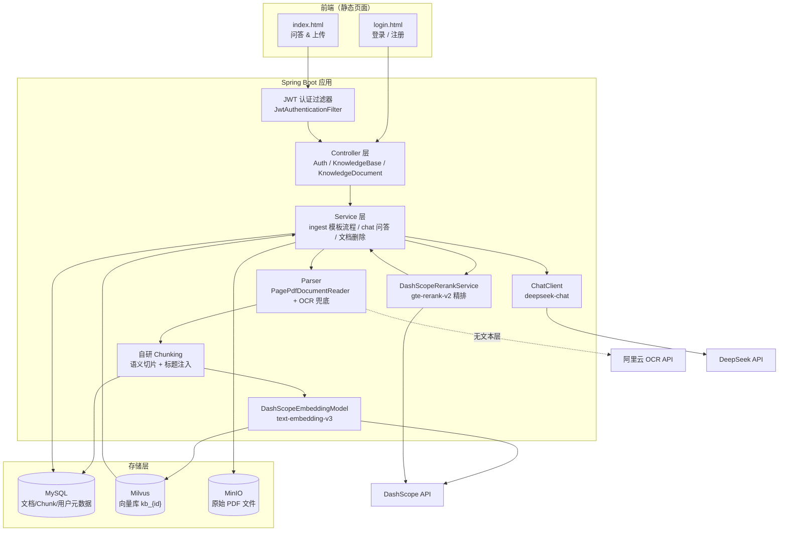

# Spring AI RAG Demo

一个基于 **Spring Boot 4 + Spring AI 2.0** 的企业级 **RAG（Retrieval-Augmented Generation，检索增强生成）** 演示项目。

项目将 PDF 文档解析、切分、向量化后存入 Milvus 向量数据库，问答时通过向量检索召回相关片段，作为上下文注入 DeepSeek 大模型生成回答，并附带可溯源的知识库引用。

---

## 目录

- [技术栈](#技术栈)
- [整体架构](#整体架构)
- [目录结构](#目录结构)
- [核心业务流程](#核心业务流程)
  - [1. 文档上传与摄取（Ingestion）](#1-文档上传与摄取ingestion)
  - [2. 知识问答（Q&A）](#2-知识问答qa)
  - [3. 文档删除](#3-文档删除)
  - [4. 用户认证（JWT）](#4-用户认证jwt)
- [数据库设计](#数据库设计)
- [配置说明](#配置说明)
- [快速开始](#快速开始)
- [REST API 一览](#rest-api-一览)
- [关键设计决策](#关键设计决策)

---

## 技术栈

| 分类 | 技术 | 说明 |
|------|------|------|
| 框架 | Spring Boot 4.0.7 | 应用基础框架（Java 17） |
| AI 框架 | Spring AI 2.0.0 | 统一抽象 Chat / Embedding / VectorStore |
| 对话模型 | DeepSeek `deepseek-chat` | 问答生成模型 |
| 向量模型 | DashScope `text-embedding-v3`（1024 维） | 文本向量化（自研 `AbstractEmbeddingModel` 实现） |
| 重排序模型 | 百炼 `gte-rerank-v2` | 召回后精排（Cross-Encoder），提升上下文质量 |
| 向量数据库 | Milvus 2.6.0 | 向量存储与相似度检索 |
| 数据库 | MySQL 8.x + MyBatis-Plus 3.5.16 | 元数据 / 用户 / chunk 文本持久化 |
| 对象存储 | MinIO 8.5.12 | 原始文档文件存储（同时支持本地磁盘模式） |
| 认证 | JWT（jjwt 0.12.6）+ BCrypt | 无状态登录认证 |
| PDF 解析 | Spring AI `PagePdfDocumentReader` | 按页解析 PDF（文本层） |
| OCR | 阿里云 OCR（`ocr_api20210707` SDK） | 扫描版 PDF（无文本层）自动识别文字 |
| 前端 | 原生 HTML / CSS / JS | `login.html` + `index.html` 静态页面 |

---

## 整体架构



**模型分工（Bean 显式限定避免歧义）：**

| 角色 | 模型 | 提供商 | Bean 名 |
|------|------|--------|---------|
| 对话 / 生成 | `deepseek-chat` | DeepSeek API | `deepSeekChatModel` |
| 向量化 | `text-embedding-v3` | DashScope（阿里云） | 自定义 `DashScopeEmbeddingModel` |
| 召回重排序 | `gte-rerank-v2` | 百炼（DashScope） | 自定义 `DashScopeRerankService` |
| 图片文字识别 | 阿里云 OCR `RecognizeAllText` | 阿里云 OCR | 自定义 `AliyunOcrService` |

> Spring AI 2.0 未内置 DashScope Embedding Starter，项目自研了 `DashScopeEmbeddingModel`（继承 `AbstractEmbeddingModel`），直接调用 DashScope REST API，输出 1024 维向量。Rerank 复用同一 DashScope API Key。

---

## 目录结构

```
spring-ai-rag-demo/
├── docker/
│   └── docker-compose.yml          # Milvus(含 etcd/attu) + MinIO 编排
├── logs/                           # 运行日志
├── pom.xml                         # Maven 依赖（Java 17）
├── mvnw / mvnw.cmd                 # Maven Wrapper
└── src/
    ├── main/
    │   ├── java/com/example/springairagdemo/
    │   │   ├── SpringAiRagDemoApplication.java
    │   │   ├── config/
    │   │   │   ├── AiConfig.java                  # ChatClient / 模型装配
    │   │   │   ├── MilvusConfig.java              # Milvus 客户端
    │   │   │   ├── RagConfigProperties.java       # rag.* 配置绑定
    │   │   │   ├── JwtUtil.java                   # JWT 生成/解析
    │   │   │   ├── JwtConfig.java                 # JWT 配置属性
    │   │   │   └── JwtAuthenticationFilter.java   # 认证过滤器
    │   │   ├── controller/
    │   │   │   ├── AuthController.java            # 注册/登录/登出/当前用户
    │   │   │   ├── KnowledgeBaseController.java   # 知识库管理
    │   │   │   └── KnowledgeDocumentController.java # 上传/问答/删除
    │   │   ├── embedding/
    │   │   │   └── DashScopeEmbeddingModel.java   # 自研 DashScope 向量模型
    │   │   ├── entity/                            # MyBatis-Plus 实体
    │   │   │   ├── KnowledgeBaseEntity.java
    │   │   │   ├── KnowledgeDocumentEntity.java   # 含 version/position 等
    │   │   │   ├── KnowledgeChunkEntity.java
    │   │   │   └── UserEntity.java
    │   │   ├── mapper/                            # MyBatis-Plus Mapper
    │   │   │   ├── KnowledgeBaseMapper.java
    │   │   │   ├── KnowledgeDocumentMapper.java
    │   │   │   ├── KnowledgeChunkMapper.java
    │   │   │   └── UserMapper.java
    │   │   ├── parser/
    │   │   │   ├── DocumentParser.java             # 解析接口
    │   │   │   └── PdfDocumentParser.java          # PDF 解析实现（含 OCR 兜底）
    │   │   └── service/
    │   │       ├── KnowledgeDocumentService.java   # 摄取模板方法 + 问答（抽象类）
    │   │       ├── PdfKnowledgeDocumentServiceImpl.java # PDF 摄取实现（岗位分类）
    │   │       ├── VectorStoreService.java         # Milvus 向量增删查
    │   │       ├── RerankService.java              # 重排序接口
    │   │       ├── DashScopeRerankService.java     # 百炼 gte-rerank 实现
    │   │       ├── OcrService.java                 # OCR 接口
    │   │       ├── AliyunOcrService.java           # 阿里云 OCR 实现
    │   │       ├── FileStorageService.java         # 文件存储接口
    │   │       ├── MinioFileStorageService.java    # MinIO 实现
    │   │       ├── LocalFileStorageService.java    # 本地磁盘实现
    │   │       ├── KnowledgeBaseService.java       # 知识库服务接口
    │   │       ├── KnowledgeDocumentEntityService.java
    │   │       ├── KnowledgeChunkEntityService.java
    │   │       ├── UserService.java                # 注册/登录（JWT + BCrypt）
    │   │       └── impl/                           # Service 实现类
    │   └── resources/
    │       ├── application.yaml                    # 全局配置
    │       ├── static/
    │       │   ├── login.html                      # 登录/注册页
    │       │   └── index.html                      # 问答/上传仪表盘
    │       └── sql/init.sql                        # 建表语句
    └── test/
```

---

## 核心业务流程

### 1. 文档上传与摄取（Ingestion）

`KnowledgeDocumentService.ingest()` 是摄取流程的**模板方法**（`@Transactional(rollbackFor = Exception.class)`），由子类 `PdfKnowledgeDocumentServiceImpl` 实现解析/切分细节：

```
上传 PDF
  │
  ├─ ① saveDocumentInfo   写入 MySQL knowledge_document
  │       · 同知识库同名文件 → 自动推断递增版本号 v1/v2/v3...
  │       · 状态置为 0（上传中）
  │
  ├─ ② parseDocument      按页解析 PDF（PagePdfDocumentReader）
  │
  ├─ ③ splitDocument      自研 Chunking：语义切片 + 标题感知注入
  │       · 段落批量 embedding 聚类 → 相邻相似度 < 0.55 处断点（语义边界）
  │       · 识别标题行构建标题链（如 "3 考勤制度 > 3.2 请假流程"），
  │         以 "【标题链】正文" 前缀注入 chunk 文本并写 metadata.heading
  │       · 超长段 token 二次切分；语义切片失败自动降级 TokenTextSplitter
  │       · 默认 chunk-size 800、min 350 字符、最大 10000 chunk
  │
  ├─ ④ saveChunks         chunk 文本批量写入 MySQL knowledge_chunk
  │       · 记录 chunk_index / content_hash(SHA-256) / page_no
  │
  ├─ ⑤ storeToVector      chunk 文本 → DashScope 向量化 → 写入 Milvus kb_{id}
  │
  ├─ ⑥ persistUploadedFile  以上全部成功后才把原始文件存入 MinIO/本地
  │       · 路径规则：{知识库id}/{年/月/日}/{文档id}_{清洗文件名}.pdf
  │
  ├─ ⑦ 更新文档状态为成功（status=3），回填 chunk_count
  │
  └─ ⑧ deprecateOldVersions  为新版设置旧版本过期时间（平滑下线）
          · 旧版本 TTL（默认 30 天）内仍可检索，超期自动过滤
```

**失败兜底：**
- 任何步骤异常 → 主事务回滚 MySQL 写入；
- 若 Milvus 已写入向量则主动删除回滚；
- 文档状态通过独立事务标记为失败（status=4），不随主事务回滚。

### 2. 知识问答（Q&A）

`KnowledgeDocumentService.chat(question, knowledgeBaseId)`：

```
用户问题
  │
  ├─ ① 向量检索   问题 → DashScope 向量化 → Milvus 相似度检索（召回候选）
  │       candidateTopK=20，相似度阈值 0.3
  │
  ├─ ② 过滤       过滤已过期版本文档的检索结果
  │
  ├─ ③ 取回文本   按 chunk_id 从 MySQL 回查完整 chunk 内容
  │
  ├─ ④ Rerank 精排 百炼 gte-rerank 对 "问题 vs 候选" 逐对打分，
  │       按相关性降序取 topN=5（失败自动降级为向量排序）
  │
  ├─ ⑤ 组装上下文 按精排顺序拼接，标注 [来源n] 文档名 + 页码
  │
  ├─ ⑥ LLM 生成   上下文注入系统提示词（仅依据知识库回答），DeepSeek 生成答案
  │
  └─ ⑦ 来源溯源   从回答中正则提取实际引用的 [来源n]，返回精准来源列表
```

**检索增强说明**：采用"先宽后精"的两阶段检索——向量召回较多候选（默认 20），再由专门的 Cross-Encoder 重排序模型精排取前 5，显著优于纯向量 top-5。

**返回结构**：`{ answer, sources: [{documentId, documentName, pageNo, snippet}] }`
前端可将 `sources` 渲染为可下载/可跳转的引用来源。

### 3. 文档删除

`KnowledgeDocumentService.deleteDocument(documentId)` 三存储独立容错：

1. MySQL：删除 `knowledge_chunk` + `knowledge_document`（同事务，原子性）
2. MinIO：删除原始文件（异常仅记日志，不阻断）
3. Milvus：按文档 ID 删除向量（异常仅记日志，不阻断）

### 4. 用户认证（JWT）

```
注册  POST /api/register   username/password/nickname/email
                             ↓
                     UserService.register
                     · 校验用户名唯一
                     · BCrypt 加密密码入库
                     · 返回 JWT Token

登录  POST /api/login      username/password
                             ↓
                     UserService.login
                     · BCrypt 校验密码
                     · 生成 JWT（有效期 7 天，默认）

访问  GET /api/user        请求头携带 Authorization: Bearer <token>
                             ↓
                     JwtAuthenticationFilter
                     · 校验 Token → 注入 request 属性 username/userId
                     · 放行 register/login/logout，拦截其余 /api/**
```

前端 `index.html` 通过 `fetchApi()` 统一在请求头注入 Token，登出时清除 `localStorage`。

---

## 数据库设计

初始化脚本：`src/main/resources/sql/init.sql`（需手动在 MySQL 执行一次）

| 表 | 用途 | 关键字段 |
|----|------|----------|
| `knowledge_base` | 知识库 | name(唯一)、description、status、create_user |
| `knowledge_document` | 文档元数据 | knowledge_id(FK)、file_name、file_path、file_size、file_type、chunk_count、embedding_model、status(0上传中/1解析中/2Embedding中/3成功/4失败)、**version**、**position**（岗位）、**expire_time**（旧版本下线时间）、**is_active** |
| `knowledge_chunk` | 文本分块 | document_id(FK)、chunk_index、content(LONGTEXT)、content_hash(SHA-256)、token_count、page_no、milvus_id |
| `knowledge_embedding_task` | 向量化任务 | task_no(唯一)、document_id(FK)、status、total/success/fail_chunk、retry_count、error_message、cost_time |
| `sys_user` | 系统用户 | username(唯一)、password(BCrypt)、nickname、email、status |

---

## 配置说明

`application.yaml` 关键配置：

| 配置项 | 说明 |
|--------|------|
| `spring.ai.deepseek.*` | DeepSeek base-url / 模型 / 温度（api-key 从环境变量 `DEEPSEEK_API_KEY` 读取） |
| `spring.ai.dashscope.*` | DashScope embedding 模型（api-key 从环境变量 `DASHSCOPE_API_KEY` 读取） |
| `spring.ai.vectorstore.milvus.*` | Milvus 连接、索引类型（IVF_FLAT/COSINE）、维度 1024 |
| `spring.datasource.*` | MySQL 连接（`knowledge_base` 库） |
| `rag.storage.type` | `minio` / `local` 文件存储切换 |
| `rag.storage.minio.*` | MinIO endpoint / 密钥 / bucket |
| `rag.document.version-ttl-days` | 旧版本文档共存天数（默认 30） |
| `rag.document.upload-dir` | 本地存储模式上传目录 |
| `rag.positions.*` | 按岗位（dev/finance/hr）独立配置分块参数 |
| `rag.rerank.enabled` | 是否启用召回重排序（默认 true） |
| `rag.rerank.model` | 重排序模型（默认 `gte-rerank-v2`） |
| `rag.rerank.candidate-top-k` | 向量召回候选数（默认 20） |
| `rag.rerank.top-n` | 精排后保留片段数（默认 5） |
| `rag.rerank.threshold` | 向量召回相似度阈值（默认 0.3） |
| `rag.rerank.fallback-on-error` | Rerank 失败时降级为纯向量排序（默认 true） |
| `rag.ocr.enabled` | 是否启用 OCR（默认 true） |
| `rag.ocr.region-id` | OCR 服务地域（默认 cn-hangzhou） |
| `rag.ocr.access-key-id/secret` | 阿里云 AccessKey（建议环境变量 `ALIYUN_OCR_AK/SK`） |
| `rag.ocr.dpi` | PDF 页渲染分辨率（默认 200） |
| `rag.ocr.min-text-length` | 页文本低于该长度触发 OCR（默认 20） |
| `rag.positions.*.heading.enabled` | 标题感知切分开关（默认 true） |
| `rag.positions.*.heading.max-depth` | 标题链最大深度（默认 3） |
| `rag.positions.*.heading.max-length` | 标题行最大字符数（默认 40） |
| `rag.positions.*.heading.prefix-template` | 标题前缀注入模板（默认 `【{heading}】`） |
| `rag.positions.*.semantic.enabled` | 语义切片开关（默认 true） |
| `rag.positions.*.semantic.threshold` | 相邻段落相似度断点阈值（默认 0.55） |
| `rag.positions.*.semantic.batch-size` | 段落 embedding 批量大小（默认 64） |
| `rag.positions.*.semantic.fallback-on-error` | 语义切片失败降级 token 切分（默认 true） |
| `jwt.secret` / `jwt.expiration-ms` | JWT 密钥（≥32 字节）与过期时间 |

> Rerank 复用 `spring.ai.dashscope.api-key`，无需单独配置 key；
> OCR 需在阿里云开通"文字识别 OCR"服务，并配置 AccessKey（建议用环境变量注入）；
> 语义切片复用 `DashScopeEmbeddingModel`（text-embedding-v3），每篇文档按段落批量向量化一次（价格极低），失败自动降级为 TokenTextSplitter。

> 注意：所有大模型 Key（DeepSeek / DashScope）均已从环境变量读取，`application.yaml` 中不再含明文密钥，可安全提交到仓库。

---

## 快速开始

### 1. 启动基础服务（Docker）

```bash
cd docker
docker-compose up -d
```

会启动：Milvus 2.6.0（+ etcd）、MinIO（9002/9003，bucket `knowledge-documents` 自动创建）、Attu 管理界面（http://localhost:8000）。

> 仓库中的 compose 未包含 MySQL 服务，需自行准备 MySQL 8.x，并执行 `src/main/resources/sql/init.sql` 初始化表结构。

### 2. 配置环境变量 / 密钥

大模型 Key 通过环境变量注入（`application.yaml` 中无明文密钥）：

| 环境变量 | 用途 |
|----------|------|
| `DEEPSEEK_API_KEY` | DeepSeek 对话模型（`deepseek-chat`） |
| `DASHSCOPE_API_KEY` | DashScope 向量模型（`text-embedding-v3`）与重排序（`gte-rerank-v2`） |
| `ALIYUN_OCR_AK` / `ALIYUN_OCR_SK` | 阿里云 OCR AccessKey（仅扫描版 PDF 需要，需在[阿里云 OCR 控制台](https://ocr.console.aliyun.com/)开通服务） |

设置示例（Windows cmd）：

```bat
set DEEPSEEK_API_KEY=sk-xxxx
set DASHSCOPE_API_KEY=sk-xxxx
set ALIYUN_OCR_AK=xxxx
set ALIYUN_OCR_SK=xxxx
```

Linux/macOS：

```bash
export DEEPSEEK_API_KEY=sk-xxxx
export DASHSCOPE_API_KEY=sk-xxxx
export ALIYUN_OCR_AK=xxxx
export ALIYUN_OCR_SK=xxxx
```

另外在 `application.yaml` 中确认：
- MySQL 连接与账号密码
- MinIO 连接（默认 `minioadmin/minioadmin`，9002 端口）

> 不需要 OCR / Rerank 时，可分别将 `rag.ocr.enabled`、`rag.rerank.enabled` 置为 `false`。

### 3. 启动应用

```bash
# Windows
mvnw.cmd spring-boot:run

# Linux/macOS
./mvnw spring-boot:run
```

### 4. 访问页面

- 登录/注册：http://localhost:8080/login.html
- 问答/上传：http://localhost:8080/index.html

---

## REST API 一览

| 方法 | 路径 | 鉴权 | 说明 |
|------|------|------|------|
| POST | `/api/register` | 否 | 用户注册，返回 JWT |
| POST | `/api/login` | 否 | 登录，返回 JWT |
| GET | `/api/user` | 是 | 当前登录用户信息 |
| POST | `/api/logout` | 是 | 登出（无状态，前端清 Token） |
| POST | `/api/knowledge-document/upload` | 是 | 上传 PDF（multipart，字段 `file`） |
| POST | `/api/knowledge-document/chat` | 是 | 知识问答（`{"question": "..."}`） |
| DELETE | `/api/knowledge-document/{id}` | 是 | 删除文档 |
| GET/POST | `/api/knowledge-base/**` | 是 | 知识库管理 |

---

## 关键设计决策

1. **模板方法模式**：`KnowledgeDocumentService` 抽象类固化摄取 8 步流程，子类只需实现 `parseDocument` / `splitDocument`，便于扩展 Word、Markdown 等格式。
2. **文件后置上传**：原始文件仅在解析、切分、向量化全部成功后写入对象存储，避免脏数据。
3. **版本平滑下线**：同名文档重传自动递增版本，旧版本 TTL 内仍可检索，避免"删旧传新"的中断。
4. **两阶段检索（Rerank）**："先宽后精"——向量召回 20 条候选，再由百炼 gte-rerank 精排取 5 条，失败自动降级为纯向量排序，兼顾效果与可用性。
5. **OCR 兜底**：PDF 文本层缺失的页面自动渲染为图片识别文字，扫描版文档与文本型文档走同一条 RAG 链路。
6. **语义切片（自研）**：Spring AI 2.0 已移除 `SemanticTextSplitter`，自行实现"段落 embedding 聚类 + 相邻相似度断点"的语义分块，避免固定 token 硬切导致的主题割裂；失败自动降级 `TokenTextSplitter`。
7. **标题感知注入**：识别数字/中文序数/无序号标题行构建标题链，将所属标题以 `【标题链】正文` 前缀注入 chunk 文本（参与向量化，孤立 chunk 也有上下文）并写 `metadata.heading` 供溯源。
6. **来源溯源**：回答中标注 `[来源n]` 并返回引用列表，LLM 未实际引用的来源会被过滤，保证溯源精准。
7. **三存储独立容错**：删除文档时 MySQL/MinIO/Milvus 各自独立处理，单个失败不阻断整体。
8. **显式 Bean 限定**：多模型场景下用 `@Qualifier` 明确 Chat 与 Embedding 的装配关系。
