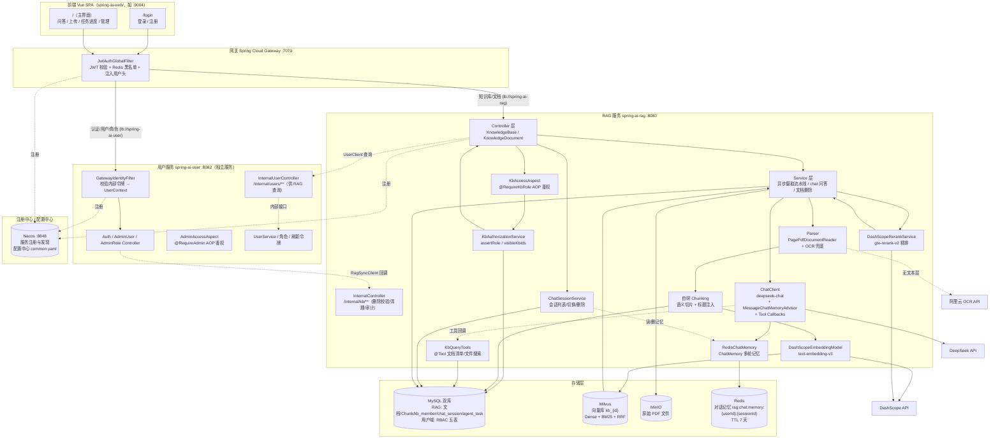

# Spring AI RAG Demo

一个基于 **Spring Boot 4 + Spring AI 2.0** 的企业级 **RAG（Retrieval-Augmented Generation，检索增强生成）** 演示项目。

项目将 PDF 文档解析、切分、向量化后存入 Milvus 向量数据库，问答时通过向量检索召回相关片段，作为上下文注入 DeepSeek 大模型生成回答，并附带可溯源的知识库引用。

---

## 目录

- [技术栈](#技术栈)
- [整体架构](#整体架构)
- [目录结构](#目录结构)
- [核心业务流程](#核心业务流程)
  - [1. 文档上传与摄取（Ingestion）](#1-文档上传与摄取ingestion)
  - [2. 知识问答（Q&A）](#2-知识问答qa)
  - [3. 文档删除](#3-文档删除)
  - [4. 用户认证与授权（JWT + RBAC）](#4-用户认证与授权jwt--rbac)
  - [5. 聊天会话管理](#5-聊天会话管理)
- [数据库设计](#数据库设计)
- [配置说明](#配置说明)
- [快速开始](#快速开始)
- [REST API 一览](#rest-api-一览)
- [关键设计决策](#关键设计决策)

---

## 技术栈

| 分类 | 技术 | 说明 |
|------|------|------|
| 框架 | Spring Boot 4.0.7 | 应用基础框架（Java 17） |
| AI 框架 | Spring AI 2.0.0 | 统一抽象 Chat / Embedding / VectorStore / Tool Calling |
| 对话模型 | DeepSeek `deepseek-chat` | 问答生成模型 |
| 工具调用 | Spring AI Tool Calling（`@Tool` / `MethodToolCallbackProvider`） | 文档清单/文件搜索等结构化查询注册为模型可自主调用的工具（`KbQueryTools`），替代关键词穷举兜底 |
| 向量模型 | DashScope `text-embedding-v3`（1024 维） | 文本向量化（自研 `DashScopeEmbeddingModel`） |
| 重排序模型 | 百炼 `gte-rerank-v2` | 召回后精排（Cross-Encoder），提升上下文质量 |
| 向量数据库 | Milvus 2.6.0（SDK `milvus-sdk-java` 2.6.23） | 向量存储 + **BM25 全文检索（Hybrid Search，RRF 融合）** |
| 数据库 | MySQL 8.x + MyBatis-Plus 3.5.16 | 业务元数据 / 用户域 RBAC / chunk 文本持久化 |
| 对象存储 | MinIO（docker `RELEASE.2024-12-18`） | 原始文档文件存储（同时支持本地磁盘模式） |
| 会话记忆/管理 | Redis（`spring-boot-starter-data-redis` + Lettuce 连接池）+ MySQL `chat_session` 表 | **多轮对话记忆**（`RedisChatMemory` 实现 Spring AI `ChatMemory`，按 `{userId}:{sessionId}` 存取、用户隔离，TTL 7 天）承载消息历史；**会话元数据**（标题/关联知识库/时间）落 MySQL `chat_session`，支撑会话列表/切换/删除；sessionId 由后端生成；Redis 与网关 Token 黑名单、用户服务刷新令牌共用同一实例 |
| 注册中心/配置中心 | Nacos 3.1.1（Spring Cloud Alibaba 2025.1.0.0） | 三服务统一注册（服务发现，网关路由用 `lb://服务名`）；公共密钥上收配置中心 `common.yaml`；配置存储使用**外部 MySQL（nacos_config 库）** |
| 服务间调用 | OpenFeign 5.0.0（spring-cloud-starter-openfeign） | RAG ↔ 用户服务跨进程调用（`UserFeignClient` / `RagSyncFeignClient`，服务名经 Nacos 发现 + 负载均衡）；`X-Internal-Token` 由全局 RequestInterceptor 注入 |
| 熔断降级 | Spring Cloud Circuit Breaker（Sentinel 1.8.9） | OpenFeign fallbackFactory 兜底（Hystrix 已 EOL，Spring Cloud 2020+ 移除其集成）；AI 问答（资源 `ai-chat`）与向量化（资源 `dashscope-embedding`）经 `CircuitBreakerFactory` 熔断保护，不可用时降级返回友好提示；DashScope Embedding 对网络异常/5xx 自动重试（最多 2 次）；可选 Sentinel Dashboard（localhost:8858，账号 sentinel/sentinel） |
| 认证/授权 | JWT（jjwt 0.12.6）+ BCrypt + RBAC | 无状态登录认证 + 知识库数据权限（防越权）；用户域独立为 `spring-ai-user` **独立服务（8082）**，Token 校验集中到网关，RAG 侧仅校验内部信任令牌 |
| 网关 | Spring Cloud Gateway 2025.1.0（gateway-server 5.0.0） | 统一入口（7070）：按路径分流（认证/用户/角色 → `lb://spring-ai-user`，知识库/文档 → `lb://spring-ai-rag`，经 Nacos 服务发现）、JWT 校验、Redis 黑名单、CORS、访问日志 |
| PDF 解析 | Spring AI `PagePdfDocumentReader` | 按页解析 PDF（文本层） |
| OCR | 阿里云 OCR（`ocr_api20210707` SDK） | 扫描版 PDF（无文本层）自动识别文字 |
| 前端 | Vue 3（Vite 5）+ vue-router | 独立工程 `spring-ai-web/`：Vite + Vue 3 SPA（组件化开发），`npm run build` 产物 `dist/`，前后端分离单独部署（Nginx 托管 `dist/` + `/api` 反代网关 7070，或直连网关走 CORS） |

---

## 整体架构



**模型分工（Bean 显式限定避免歧义）：**

| 角色 | 模型 | 提供商 | Bean 名 |
|------|------|--------|---------|
| 对话 / 生成 | `deepseek-chat` | DeepSeek API | `deepSeekChatModel` |
| 向量化 | `text-embedding-v3` | DashScope（阿里云） | 自定义 `DashScopeEmbeddingModel` |
| 召回重排序 | `gte-rerank-v2` | 百炼（DashScope） | 自定义 `DashScopeRerankService` |
| 图片文字识别 | 阿里云 OCR `RecognizeAllText` | 阿里云 OCR | 自定义 `AliyunOcrService` |

> Spring AI 2.0 未内置 DashScope Embedding Starter，项目自研了 `DashScopeEmbeddingModel`（继承 `AbstractEmbeddingModel`），直接调用 DashScope REST API，输出 1024 维向量。Rerank 复用同一 DashScope API Key。

---

## 目录结构

```
spring-ai-rag-demo/
├── docker/
│   └── docker-compose.yml          # Milvus(含 etcd/attu) + doc-minio + Redis + Nacos(外部 MySQL 存储) + Sentinel Dashboard + 前端 Nginx(frontend-nginx:9004) 编排
├── spring-ai-web/                  # 独立 Vue 3 前端工程（Vite + vue-router）：src/ 组件化开发，npm run build 产物 dist/；nginx.conf / README.md
├── nacos/
│   ├── common.yaml                 # Nacos 配置中心共享配置（三端密钥，导入控制台）
│   └── README.md                   # Nacos 接入说明（启动/初始化/导入/验证）
├── pom.xml                         # 聚合父 POM（Java 17，依赖/版本管理，含 Spring Cloud/SCA BOM；仅保留三服务通用依赖）
├── mvnw / mvnw.cmd                 # Maven Wrapper
├── spring-ai-rag/                  # RAG 服务（独立部署，端口 8080）
│   └── src/main/java/com/example/springairagdemo/
│       ├── SpringAiRagDemoApplication.java # @SpringBootApplication(仅扫描本模块)
│       ├── config/
│       │   ├── AiConfig.java                  # ChatClient / 模型装配 + MessageChatMemoryAdvisor（多轮记忆）+ ToolCallbacks（KbQueryTools）+ Sentinel 熔断规则（ai-chat / dashscope-embedding）
│       │   ├── MilvusConfig.java              # Milvus 客户端
│       │   ├── RagConfigProperties.java       # rag.* 配置绑定（rerank/hybrid/ocr/storage/chunk 等）
│       │   ├── AsyncTaskConfig.java           # Embedding 异步任务线程池（taskExecutor）
│       │   ├── AsyncTaskProperties.java       # 线程池参数绑定（spring.task.embedding.*）
│       │   ├── NamedThreadFactory.java        # rag-embedding-N 线程命名
│       │   ├── DataSourceConfig.java          # @Primary 数据源 + MyBatis-Plus 装配（HikariCP）
│       │   ├── DatabasePoolProperties.java    # 连接池参数绑定（spring.datasource.pool.*）
│       │   ├── DataInitializer.java           # 启动初始化（恢复中断任务）
│       │   ├── FeignConfig.java               # 全局 RequestInterceptor（注入 X-Internal-Token）
│       │   └── GlobalExceptionHandler.java    # 全局异常 → 统一 JSON
│       ├── controller/
│       │   ├── KnowledgeBaseController.java   # 知识库管理 + 成员授权
│       │   ├── KnowledgeDocumentController.java # 上传/任务轮询/问答(SSE 流式+同步双模式)/删除/下载/清空记忆
│       │   ├── ChatSessionController.java     # 聊天会话管理（创建/列表/消息/删除，历史消息引用来源回补）
│       │   ├── AgentTaskController.java       # Agent 任务可观测性（列表/详情含步骤轨迹）
│       │   └── InternalController.java        # /internal/kb/**（用户服务回调：删除校验/清理/审计）
│       ├── security/                          # 防越权 + 本地身份上下文
│       │   ├── KbRole.java                    # 知识库角色枚举 VIEWER < EDITOR < OWNER
│       │   ├── RequireKbRole.java             # 知识库角色注解（方法级）
│       │   ├── KbAccessAspect.java            # @RequireKbRole AOP 切面
│       │   ├── GatewayIdentityFilter.java     # 校验 X-Gateway-Token + 消费身份头 → UserContext
│       │   ├── LoginUser.java / UserContext.java # 本地登录态（ThreadLocal，来自网关注入）
│       │   └── ForbiddenException.java        # 403 异常（本地版）
│       ├── embedding/
│       │   └── DashScopeEmbeddingModel.java   # 自研 DashScope 向量模型（网络异常/5xx 自动重试）
│       ├── entity/                            # MyBatis-Plus 实体 + 枚举
│       │   ├── KnowledgeBaseEntity.java
│       │   ├── KnowledgeDocumentEntity.java   # 含 version / status(7态) / expire_time
│       │   ├── KnowledgeChunkEntity.java
│       │   ├── KnowledgeEmbeddingTaskEntity.java # 任务 + 5 个阶段进度字段
│       │   ├── DocumentStatus.java            # 文档状态枚举（0上传中~6已过期）
│       │   ├── KnowledgeEmbeddingTaskStatus.java # 任务状态枚举（0待处理~3失败）
│       │   ├── KbMemberEntity.java            # 知识库成员授权（数据权限）
│       │   ├── KbAccessLogEntity.java         # 访问审计日志
│       │   ├── ChatSessionEntity.java         # 聊天会话元数据（标题/关联知识库/时间）
│       │   ├── AgentTaskEntity.java           # Agent 任务（一次提问的执行审计单元）
│       │   └── AgentTaskStepEntity.java       # Agent 任务步骤（工具调用轨迹）
│       ├── mapper/                            # MyBatis-Plus Mapper（业务表，含 ChatSessionMapper）
│       ├── parser/
│       │   ├── DocumentParser.java            # 解析接口
│       │   ├── PdfDocumentParser.java         # PDF 解析实现（含 OCR 兜底）
│       │   ├── HeadingExtractor.java          # 标题行识别 / 标题链构建
│       │   └── SemanticSplitter.java          # 语义切片（段落聚类 + 断点）
│       ├── memory/
│       │   └── RedisChatMemory.java           # ChatMemory 实现：多轮对话记忆（Redis 持久化，TTL 7 天，工具消息不入库）
│       ├── tools/
│       │   └── KbQueryTools.java              # 知识库查询工具集（@Tool：listDocuments / searchDocuments）+ 显式文档解析（问题点名文档时限定召回）
│       ├── feign/                             # 跨服务调用用户服务
│       │   ├── UserFeignClient.java           # /internal/users/**（isAdmin / 用户摘要）
│       │   └── UserFeignClientFallbackFactory.java # 熔断降级兜底（安全默认值）
│       └── service/
│           ├── AgentTaskService.java             # Agent 任务/步骤落库 + 按会话回补引用来源快照
│           ├── KnowledgeDocumentService.java      # 摄取异步流水线 + 问答（流式/同步 + 多轮记忆，抽象类）
│           ├── PdfKnowledgeDocumentServiceImpl.java # PDF 摄取实现
│           ├── VectorStoreService.java            # Milvus 增删查（embedChunks / upsertVectors，熔断保护）
│           ├── HybridSearchService.java           # 混合检索编排（RRF 融合 + 异常降级）
│           ├── RerankService.java / DashScopeRerankService.java  # 重排序接口与实现
│           ├── OcrService.java / AliyunOcrService.java           # OCR 接口与实现
│           ├── FileStorageService.java / MinioFileStorageService.java / LocalFileStorageService.java
│           ├── KnowledgeEmbeddingTaskService.java # 任务服务（提交/进度/恢复）
│           ├── KnowledgeBaseService.java / KnowledgeDocumentEntityService.java
│           ├── KnowledgeChunkEntityService.java / impl/
│           ├── KbAuthorizationService.java        # 权限判定中枢（assertRole/visibleKbIds/授权）
│           ├── KbMemberService.java / KbAccessLogService.java
│           ├── ChatSessionService.java / ChatSessionServiceImpl.java # 会话元数据（MySQL）+ 消息联动（创建/列表/消息/删除）
│           ├── KbMemberDeletionGuard.java         # 删用户前最后所有者保护 + 清理 kb_member
│           ├── KbAccessLogAuditHandler.java       # 管理操作审计落库 kb_access_log
│           ├── UserClient.java                    # 远程查用户服务：isAdmin / 用户摘要
│           ├── EmbeddingServiceUnavailableException.java # 向量化故障统一异常（友好提示）
│           └── impl/                              # Service 接口实现类
├── spring-ai-user/                 # 用户服务（独立部署，端口 8082，独立数据库 spring_ai_user）
│   └── src/main/java/com/example/user/
│       ├── UserServiceApplication.java # 独立启动类（@MapperScan 用户域 mapper）
│       ├── config/
│       │   ├── JwtUtil.java                    # JWT 生成/解析（权限码写入 Access Token）
│       │   ├── JwtConfig.java                  # JWT 配置属性（注册 GatewayIdentityFilter）
│       │   ├── GatewayIdentityFilter.java      # 校验网关内部令牌并注入登录态（UserContext）
│       │   ├── RagSyncClient.java              # 回调 RAG /internal/kb/**（删除校验/清理/审计）
│       │   └── FeignConfig.java                # 全局 RequestInterceptor（注入 X-Internal-Token）
│       ├── controller/
│       │   ├── AuthController.java             # 注册/登录/登出/当前用户/用户搜索
│       │   ├── AdminUserController.java        # 系统管理-用户（需 ADMIN，经 RagSyncClient 联动 RAG）
│       │   ├── AdminRoleController.java        # 系统管理-角色（需 ADMIN）
│       │   └── InternalUserController.java     # /internal/users/**（供 RAG 查 isAdmin/用户摘要）
│       ├── security/                           # 认证上下文 + ADMIN 切面
│       │   ├── LoginUser.java / UserContext.java / ForbiddenException.java
│       │   ├── RequireAdmin.java               # ADMIN 功能角色注解（方法级）
│       │   └── AdminAccessAspect.java          # @RequireAdmin AOP 切面
│       ├── entity/                             # 用户域实体（RBAC 五表）
│       │   ├── UserEntity.java / SysRoleEntity.java / SysPermissionEntity.java
│       │   └── SysUserRoleEntity.java / SysRolePermissionEntity.java
│       ├── mapper/                             # UserMapper / SysRoleMapper / SysPermissionMapper / 两级关联 Mapper
│       ├── feign/                              # RagSyncFeignClient + RagSyncFeignClientFallbackFactory
│       └── service/
│           ├── UserService.java                # 注册/登录/删除用户/isAdmin（JWT + BCrypt）
│           ├── SysRoleService.java / SysPermissionService.java / 两级关联 Service
│           ├── RedisRefreshTokenService.java   # 刷新令牌 + 登出黑名单
│           └── UserDataInitializer.java        # 启动初始化（ADMIN 角色/权限种子/默认账号）
├── gateway/                        # 网关子模块（Spring Cloud Gateway，端口 7070）
│   └── src/main/java/com/example/gateway/
│       ├── GatewayApplication.java    # 启动类
│       ├── security/JwtUtil.java      # JWT 校验工具（secret 与用户服务共享一致）
│       └── filter/
│           ├── JwtAuthGlobalFilter.java # 全局认证过滤器（白名单/黑名单/注入用户头）
│           └── LoggingGlobalFilter.java # 全局访问日志过滤器
└── sql/
    ├── init.sql                              # RAG 业务库初始化（知识库/文档/任务/成员授权/审计日志/聊天会话）
    ├── user.sql                              # 用户服务独立库初始化（RBAC 五表 + 权限种子 + admin 账号）
    └── mysql-nacos.sql                       # Nacos 3.1.1 官方建表脚本（宿主机 MySQL 初始化 nacos_config 库用）
```

---

## 核心业务流程

### 1. 文档上传与摄取（异步任务流水线）

摄取采用**异步任务制**：`submitIngest` 快速返回 `taskNo`，实际处理在自定义线程池（`rag-embedding-N`）中执行 `processTaskAsync`。入口先执行 `assertRole(kbId, EDITOR)` 权限校验（需 EDITOR 及以上）。

文档状态机（`status`，7 态）：

```
 0 UPLOADING ──→ 1 PARSING ──→ 2 EMBEDDING ──→ 3 SUCCESS
     上传中         解析中         向量化中         成功
                    │                              │
                    │                              ├─→ 5 DEPRECATED（被新版顶替，TTL 内仍可检索）
                    │                              │       └─→ 6 EXPIRED（TTL 到期懒标记过滤）
                    └─→ 4 FAILED（失败，保留半成品供增量恢复）
```

```
上传 PDF（multipart）
  │
  ├─ ① 提交阶段（submitIngest，接口立即返回 taskNo）
  │       · saveDocumentInfo   写入 MySQL knowledge_document
  │           - 同知识库同名文件 → 自动推断递增版本号 v1/v2/v3...
  │             （版本号取同名文档全部状态中的最大版本 +1，防重号）
  │           - 状态置 0（UPLOADING 上传中）
  │       · persistUploadedFile 最先持久化原始文件（MinIO/本地），失败可恢复
  │           - 路径规则：{知识库id}/{年/月/日}/{文档id}_{清洗文件名}.pdf
  │       · 创建 Embedding 任务（status=0 待处理），提交线程池执行
  │       · 提交阶段失败 → 补偿删除文件 + document/task 记录（防孤儿）
  │
  └─ ② 异步处理（processTaskAsync，任务状态 0待处理→1处理中→2成功/3失败）
        │  文档状态 0上传中 → 1解析中 → 2向量化中 → 3成功 / 4失败
        │
        ├─ 解析       PagePdfDocumentReader 按页解析（无文本层 OCR 兜底）
        │             → parse_progress = 100%
        ├─ 切分       SemanticSplitter：语义切片 + 标题感知注入
        │             · 段落批量 embedding 聚类 → 相邻相似度 < 0.55 处断点
        │             · 标题链注入（如 "3 考勤制度 > 3.2 请假流程"）写 metadata.heading
        │             · 超长段 token 二次切分；失败自动降级 TokenTextSplitter
        │             · 默认 chunk-size 800、min 350 字符、最大 10000 chunk
        │             → split_progress = 100%
        ├─ 增量分类    与已有 chunk 对比（chunk_index + content_hash）
        │             toSave(新增/变化) / toVectorOnly(缺向量) / skip(已完整) / stale(删除)
        ├─ Chunk 入库  saveBatch 批量写 MySQL knowledge_chunk（主键回填）
        │             → chunk_progress = 100%
        ├─ Embedding  按 batch-size 分批向量化（embed_progress 0→100%，逐批回写）
        │             · DashScope 网络异常/5xx 自动重试（最多 2 次，4xx 业务错误不重试）
        │             · Sentinel 熔断保护（资源 dashscope-embedding），异常比例高时快速失败
        │             · 失败错误信息归一为「向量化服务暂时不可用，请稍后重试」
        ├─ Milvus     按 batch-size 分批 upsert 到 kb_{id}（milvus_progress 0→100%）
        │             · 回填 milvus_id：作为"向量已写入"的增量判定标记
        │             · 每批更新任务 success_chunk，前端 5 行进度条实时展示
        ├─ 置成功      文档状态 3（SUCCESS），回填 chunk_count
        └─ 旧版下线    deprecateOldVersions：同名旧版置 5（DEPRECATED）+ 设 expire_time
                      （TTL 默认 30 天，到期后懒标记为 6 EXPIRED 并过滤）
```

**失败兜底（增量执行，不整批回滚）：**
- 任何步骤异常 → 任务标记失败（status=3），文档置 4（FAILED），记录 error_message（向量化类故障归一为「向量化服务暂时不可用，请稍后重试」，其余异常截断至 200 字符）；
- 半成品保留：已写 MySQL chunk / 已写 Milvus 向量按 `milvus_id` 判空标记，作为恢复线索；
- 重启恢复：启动时扫描中断任务 → 重新入队增量补齐（解析/切分/embedding 幂等，仅处理未回填 milvus_id 的 chunk）。

### 2. 知识问答（Q&A）

`KnowledgeDocumentService.chat(question, knowledgeBaseId, sessionId)`（同步） / `chatStream(...)`（流式，入口先执行 `assertRole(kbId, VIEWER)`，需 VIEWER 及以上）：

```
用户问题 + 会话 ID（sessionId 由后端生成：POST /api/chat-session/create，前端存 localStorage；
            旧版本前端残留的随机 ID 首次问答时自动补建会话记录，平滑接入会话列表）
  │
  ├─ ① 会话记忆   进入问答先 touchOnChat 落会话元数据（首个问题截断为标题、补 knowledge_base_id）；
  │       MessageChatMemoryAdvisor 按会话 ID 从 Redis（key rag:chat:memory:{userId}:{sessionId}，
  │       userId 由服务端 UserContext 注入，会话按用户隔离）读取历史（仅 user/assistant 消息，
  │       窗口保护最近 100 条，TTL 7 天）注入 prompt，实现多轮上下文连贯；
  │       · system 检索上下文不落库（避免污染记忆）；「清空对话」= 后端删 Redis 记忆 + 前端清空消息
  │
  ├─ ② 检索召回   Hybrid Search：问题 → DashScope 向量化（Dense 路）+ 关键词全文（BM25 路），
  │       Milvus 端 RRF 融合，召回 candidateTopK=20 候选
  │       · rag.hybrid.enabled=false 时降级为纯向量相似度检索（阈值 0.3）
  │       · 显式文档限定：问题点名某份文档（带扩展名完整文件名 / 书名号）时，先用 Milvus filter
  │         把召回限定在目标文档内（限定文档时 Hybrid 不支持 filter，自动改走纯向量检索），
  │         从源头杜绝名称相近文档（如"纯图片产品说明书_扫描件.pdf"）的 chunk 混入引用来源
  │       · 多轮指代：当轮未点名但含指代/续问词（如"上面的问题再查一遍"）时，回看会话记忆
  │         中最近一轮用户问题，沿用其显式文档限定，避免检索退化为全库召回
  │
  ├─ ③ 过滤       状态白名单：仅 SUCCESS(3) / DEPRECATED(5) 参与问答（排除处理中/失败/过期）
  │       · 懒标记过期：chat 开头将 TTL 到期的旧版本标记为 EXPIRED(6) 并过滤
  │       · 同名多版本只保留版本号最高的检索结果（新版优先，防止新旧混召）
  │
  ├─ ④ 取回文本   按 chunk_id 从 MySQL 回查完整 chunk 内容
  │
  ├─ ⑤ Rerank 精排 百炼 gte-rerank 对 "问题 vs 候选" 逐对打分，
  │       按相关性降序取 topN=5（失败自动降级为向量排序）
  │
  ├─ ⑥ 组装上下文 按精排顺序拼接，标注 [来源n] 文档名 + 页码
  │
  ├─ ⑦ 工具调用   （可选，信号驱动）若检索为空，改用"空上下文系统提示词"引导模型自主决定：
  │       涉及文档清单/文件搜索等结构化信息时调用 KbQueryTools（listDocuments / searchDocuments），
  │       userId/kbId 经 ToolContext 注入，回调线程内显式校验 VIEWER 权限；
  │       新增查询类型只需加 @Tool 方法，无需穷举关键词；
  │       回答核心信息来自工具结果时，提示词要求在末尾统一标注相关检索片段
  │       （"以上内容详见[来源1][来源2][来源3]"）
  │
  ├─ ⑧ LLM 生成   上下文注入系统提示词（仅依据知识库回答），DeepSeek 生成答案
  │       · 流式（默认 stream=true）：SSE（text/event-stream）逐 token 输出，降低首字延迟
  │       · 同步（stream=false）：一次性返回完整 JSON
  │       · 熔断降级：调用异常/超时或 Sentinel 熔断（资源 ai-chat）→ 返回「AI服务暂时不可用，请稍后再试」
  │       · 综合引用：多相关片段须分别标注 [来源1][来源2][来源3]，禁止只引其一
  │
  └─ ⑨ 来源溯源   返回检索/精排后的全部候选来源列表（不再按回答中的 [来源N] 过滤，避免漏显）；
        引用编号经 alignCitations 对齐校验（逐字引用片段与来源内容匹配，纠正张冠李戴）；
        历史消息回显时从 agent_task 引用来源快照回补
```

**检索增强说明**：采用"先宽后精"的两阶段检索——**混合检索**（Dense 语义向量 + BM25 全文关键词双路召回，RRF 融合）召回较多候选（默认 20），再由专门的 Cross-Encoder 重排序模型精排取前 5，显著优于纯向量 top-5。BM25 路能召回向量路遗漏的"关键词精确命中"片段，对专有名词、编号、缩写类问题尤其有效。

**显式文档限定**：问题明确点名文档（"xx.pdf 里写了什么"）时，先经 `resolveExplicitDocuments`（带扩展名完整文件名 / 书名号归一化四级匹配）定位目标文档，用 Milvus filter 把召回限制在目标文档内——杜绝名称相近文档的 chunk 因关键词命中（如"说明书"）混入引用来源；多轮指代（如"上面的问题再查一遍"）时回看会话记忆最近一轮用户问题，沿用其显式文档限定（`resolveExplicitDocumentsWithHistory`）。

**返回结构**：
- 流式（默认）：SSE 事件序列——`{"type":"tool","name":...,"status":"running|done|error","args":...,"result":...}`（模型自主调用工具的过程，先于内容下发）→ `{"type":"delta","content":...}`（逐 token 增量）→ `{"type":"final","content":...}`（引用对齐校验后的最终全文，前端覆盖显示）→ `{"type":"sources","sources":[...]}`（生成完毕下发**全部候选**来源，前端全量展示）→ `{"type":"done"}`；出错时下发 `{"type":"error","message":...}`
- 同步（`stream=false`）：`{ answer, sources: [{documentId, documentName, pageNo, snippet}] }`（sources 同样为全部候选）
- 前端将 `sources` 渲染为可点击高亮/可下载的引用来源（`.source-ref` 标签与来源列表编号对应）；AI 服务不可用时返回 `answer="AI服务暂时不可用，请稍后再试"`、`sources=[]`（接口正常 200，前端可直接展示降级提示）

### 3. 文档删除

`KnowledgeDocumentService.deleteDocument(documentId)` 三存储独立容错（对象级权限：先按文档 ID 查所属知识库，再 `assertRole(kbId, EDITOR)` 校验）：

1. MySQL：删除 `knowledge_chunk` + `knowledge_document`（同事务，原子性）
2. MinIO：删除原始文件（异常仅记日志，不阻断）
3. Milvus：按文档 ID 删除向量（异常仅记日志，不阻断）

### 4. 用户认证与授权（JWT + RBAC）

**认证**（识别"你是谁"）：

注册/登录由**独立服务 `spring-ai-user`**（8082，经 Nacos 注册）签发 JWT（`UserService`：BCrypt 校验密码、签发 Access Token、刷新/登出维护 Redis 黑名单），此后所有 `/api/**` 请求统一经网关 7070 进入：

```
访问  /api/**            请求头携带 Authorization: Bearer <token>（页面由 spring-ai-web 前端加载，接口统一走 7070）
                            ↓
              网关 JwtAuthGlobalFilter（7070，GlobalFilter order=-200）
              · 白名单放行：/api/register、/api/login、/api/logout、/api/refresh
              · 校验 Token 签名与有效期（jjwt，secret 与用户服务完全一致）
              · 查 Redis 黑名单（登出/刷新后旧 Token 立即失效）
              · 注入 X-User-Id / X-Username / X-Permissions / X-Gateway-Token 后按路径分流
                            ↓
              下游服务 GatewayIdentityFilter（spring-ai-user:8082 / spring-ai-rag:8080，各自本地实现）
              · 校验 X-Gateway-Token（内部信任令牌，防绕过网关直连伪造身份）
              · 构造 LoginUser（含 JWT 中缓存的权限码）→ UserContext.set() → 进入业务鉴权（RBAC / kb_member）
              · 请求结束 finally 中 UserContext.clear()
```

**授权**（判定"你能做什么"）——纵深防御三层：

```
① 注解式入口校验（AOP）
   @RequireKbRole(EDITOR) 等标注在 Controller 方法上
   KbAccessAspect 自动从方法参数解析 kbId（参数名 / 唯一 Number / JSON body）
   → KbAuthorizationService.assertRole(kbId, role)

② Service 层守卫（核心业务兜底）
   submitIngest() → assertRole(kbId, EDITOR)  # 上传文档
   chat()    → assertRole(kbId, VIEWER)   # 问答检索
   deleteDocument() → 对象级：先查文档所属 kbId 再校验

③ 数据源头过滤（防泄露）
   list / knowledge-bases 强制按「当前用户可见知识库集合」过滤
   download/delete 为对象级安全：先 getDocument() 取 kbId 再校验
```

**角色模型（双层权限）：**

- **垂直权限（RBAC）**：`sys_user_role` 关联全局角色，`ADMIN` 为超级管理员，放行全部操作（不参与 kb_member 判定）。
- **水平权限（数据授权）**：`kb_member` 记录"用户 × 知识库 × 角色"，是知识库访问的唯一权威。

| 角色 | 级别 | 权限 |
|------|------|------|
| `ADMIN` | 全局 | 全部操作（不看 kb_member） |
| `OWNER` | 4 | 管理/删除/授权成员 + 上传/编辑 + 查看检索 |
| `EDITOR` | 3 | 上传/编辑文档 + 查看检索 |
| `VIEWER` | 2 | 仅查看/检索/下载 |

安全特性：
- **创建人强制**：创建知识库时 `createUser` 取自登录态（不信任前端传参），创建者自动成为 OWNER；
- **最后一个 OWNER 保护**：移除成员时不允许移除知识库最后一名 OWNER；
- **AOP 自动解析 kbId**：无需手工写重复鉴权代码；
- **统一 403**：`GlobalExceptionHandler` 将 `ForbiddenException` 转为 `{success:false, code:403}`；
- **审计日志**：`kb_access_log` 记录关键访问行为；
- 默认初始化 `ADMIN` 角色 + `admin/admin123` 账号（见用户域 `UserDataInitializer`）。

**权限管理（系统管理模块，仅 ADMIN 可见）：**

- **用户管理**：用户列表（含功能角色标签）/ 创建用户 / 启用禁用 / 重置密码 / 删除（自动清理角色与数据授权）；
- **角色管理**：角色列表（含用户数）/ 创建角色 / 删除角色（内置 `ADMIN` 不可删除）；
- **分配功能角色**：在用户列表中对指定用户勾选角色（`sys_user_role` 覆盖式重写），并保护"最后一个 ADMIN"不会被降权/禁用/删除；
- **数据权限**：知识库列表每行「成员」按钮 → 搜索用户 + 选择 `VIEWER/EDITOR/OWNER` 授权，可移除成员（最后一个 OWNER 保护）。

前端（`spring-ai-web/` Vue 工程）通过 `src/api/request.js` 的 `fetchApi()` 统一在请求头注入 Token，登出时清除 `localStorage`；`/api/user` 返回 `isAdmin`，据此控制「系统管理」菜单显隐。

---

### 5. 聊天会话管理

会话由**后端生成 ID**（`POST /api/chat-session/create`，UUID 无横线），前端只负责存取与展示：

| 接口 | 说明 |
|------|------|
| `POST /api/chat-session/create` | 创建会话（可选绑定 `knowledgeBaseId`），返回后端生成的 `sessionId` |
| `GET /api/chat-session/list` | 当前用户会话列表（按最近更新倒序） |
| `GET /api/chat-session/{sessionId}/messages` | 拉取指定会话历史消息（Redis 记忆 + 引用来源回补，归属校验：仅本人会话） |
| `DELETE /api/chat-session/{sessionId}` | 删除会话：删 MySQL 元数据 + Redis 记忆（联动清除） |

- **元数据与消息分离**：`chat_session` 表（MySQL）只存会话标题/关联知识库/时间，消息历史仍在 Redis（`rag:chat:memory:{userId}:{sessionId}`），两者按 `sessionId` 关联；
- **自动补建**：问答入口 `touchOnChat` 发现未知 sessionId（旧版本前端 localStorage 残留）自动补插会话记录，旧数据平滑接入会话列表；
- **标题自动生成**：会话标题取首个问题的前 30 字（去空白、截断加省略号）；
- **归属隔离**：列表/消息/删除均按 `UserContext` 的 userId 过滤，只能操作自己的会话；
- **清空对话**：`POST /api/knowledge-document/chat/clear-memory` 删除 Redis 记忆（会话记录保留，前端更换新 ID 继续提问）。

---

## 数据库设计

项目采用**双库隔离**（同一 MySQL 实例、不同 schema，分别由两个服务连接）：

| 库 | 归属服务 | 数据源配置 | 内容 |
|----|---------|-----------|------|
| `knowledge_base` | RAG 服务 spring-ai-rag（8080） | `spring.datasource.*`（主数据源 @Primary，DataSourceConfig 装配） | 知识库/文档/分块/向量化任务/成员授权/审计日志/聊天会话 |
| `spring_ai_user` | 用户服务 spring-ai-user（8082） | `spring.datasource.*`（标准主数据源，MyBatis-Plus 自动装配） | RBAC 五表：用户/角色/权限/两级关联 |

另外 **Nacos 配置中心**也使用同一 MySQL 实例中的 `nacos_config` 库存储配置（见 [快速开始](#快速开始) 第 1 步）。

初始化脚本（均幂等，需手动在 MySQL 各执行一次）：
- `sql/init.sql` — RAG 业务库：`knowledge_base` / `knowledge_document` / `knowledge_chunk` / `knowledge_embedding_task` / `kb_member` / `kb_access_log` / `chat_session` / `agent_task` / `agent_task_step`。
- `sql/user.sql` — 用户域独立库：`sys_user` / `sys_role` / `sys_permission` / `sys_user_role` / `sys_role_permission`，以及内置 `ADMIN` 角色、6 个权限种子、`admin` 账号与绑定关系。
- `sql/mysql-nacos.sql` — Nacos 3.1.1 官方 schema，用于初始化 `nacos_config` 库（仅 Nacos 用，业务服务不连接）。

用户服务启动时 `UserDataInitializer` 也会自动补齐 `ADMIN` 角色、权限种子与默认账号（幂等）。
`kb_member` / `kb_access_log` 中的 `user_id` 为**跨库逻辑引用**（无外键约束），删除用户前由用户服务经 `RagSyncClient` 远程回调 RAG 服务 `POST /internal/kb/deletion-check`（校验）与 `/internal/kb/user-cleanup`（清理 kb_member）完成联动。

**RAG 业务库（knowledge_base）**：

| 表 | 用途 | 关键字段 |
|----|------|----------|
| `knowledge_base` | 知识库 | name(唯一)、description、status、create_user |
| `knowledge_document` | 文档元数据 | knowledge_id(FK)、file_name、file_path、file_size、file_type、chunk_count、embedding_model、status(**0上传中/1解析中/2向量化中/3成功/4失败/5已废弃/6已过期**)、**version**、**expire_time**（旧版本下线时间）、**is_active** |
| `knowledge_chunk` | 文本分块 | document_id(FK)、chunk_index、content(LONGTEXT)、content_hash(SHA-256)、token_count、page_no、milvus_id |
| `knowledge_embedding_task` | 向量化任务 | task_no(唯一)、document_id(FK)、status(0待处理/1处理中/2成功/3失败)、total/success/fail_chunk、**parse/split/chunk/embed/milvus_progress（阶段进度 0-100）**、retry_count、error_message、cost_time |
| `kb_member` | 知识库成员授权（数据权限） | knowledge_id、user_id、role(VIEWER/EDITOR/OWNER)、create_time |
| `kb_access_log` | 访问审计日志 | user_id、knowledge_id、action、ip、create_time |
| `chat_session` | 聊天会话元数据 | user_id、session_id(后端 UUID 唯一，`uk_user_session`)、title(首个问题截断 30 字)、knowledge_base_id、create_time/update_time |
| `agent_task` | Agent 任务（一次提问的执行审计单元，可观测性） | user_id、session_id、kb_id、question、answer(LONGTEXT)、sources(引用来源 JSON)、prompt(LLM 实际输入)、model、prompt_tokens/completion_tokens/total_tokens、status(0执行中/1成功/2失败)、tool_count、cost_ms、error_msg、start_ms、create_time/finish_time |
| `agent_task_step` | Agent 任务步骤轨迹（工具调用过程） | task_id、type(TOOL_CALL)、tool_name、status(running/done/error)、args、result、latency_ms(该步耗时)、create_time |

**用户域独立库（spring_ai_user）—— RBAC 经典五表**：

| 表 | 用途 | 关键字段 |
|----|------|----------|
| `sys_user` | 系统用户 | username(唯一)、password(BCrypt)、nickname、email、status |
| `sys_role` | 角色 | code(唯一，如 ADMIN)、name、remark、status |
| `sys_permission` | 权限（按钮/API 级权限码） | code(唯一，如 kb:manage)、name、type(1-菜单/2-按钮/API)、parent_id、sort、status |
| `sys_user_role` | 用户-角色关联 | user_id、role_id（联合唯一） |
| `sys_role_permission` | 角色-权限关联 | role_id、permission_id（联合唯一） |

权限模型：**用户 → 角色（`sys_user_role`）、角色 → 权限（`sys_role_permission`）** 链式授权；登录/刷新/`/api/user` 返回当前用户权限码集合 `permissions`；ADMIN 角色默认绑定全部权限，角色权限分配见 `PUT /api/admin/roles/{id}/permissions`。

---

## 配置说明

**spring-ai-rag（`spring-ai-rag/src/main/resources/application.yaml`）关键配置：**

| 配置项 | 说明 |
|--------|------|
| `spring.config.import` | 配置中心：`optional:nacos:common.yaml`（三端密钥；`optional` 前缀保证 Nacos 不可用时本地兜底仍可启动） |
| `spring.ai.deepseek.*` | DeepSeek base-url / 模型 / 温度（api-key 从环境变量 `DEEPSEEK_API_KEY` 读取） |
| `spring.ai.dashscope.*` | DashScope embedding 模型（api-key 从环境变量 `DASHSCOPE_API_KEY` 读取） |
| `spring.ai.vectorstore.milvus.*` | Milvus 连接、索引类型（IVF_FLAT/COSINE）、维度 1024（collection 按知识库动态创建，`initialize-schema: false`） |
| `spring.datasource.*` | MySQL 连接（`knowledge_base` 库） |
| `spring.datasource.pool.*` | HikariCP 连接池（maximum-pool-size=10、minimum-idle=2、连接/空闲/存活超时等） |
| `spring.task.embedding.*` | 摄取异步任务线程池（core=2/max=4/queue=50/命名 rag-embedding-N/优雅停机等待） |
| `spring.data.redis.*` | Redis 多轮对话记忆（`RedisChatMemory`：host/port、db 0、Lettuce 连接池；key 前缀 `rag:chat:memory:{userId}:{会话ID}`，TTL 7 天；与用户服务/网关共用同一实例） |
| `spring.servlet.multipart.*` | 上传大小限制（50MB） |
| `spring.cloud.nacos.*` | Nacos 注册/配置中心地址（`server-addr: localhost:8848`，3.x 默认账号 nacos/nacos） |
| `spring.cloud.sentinel.*` | Sentinel transport（Dashboard 上报，`eager` 启动即注册，可选） |
| `rag.storage.type` | `minio` / `local` 文件存储切换 |
| `rag.storage.minio.*` | MinIO endpoint / 密钥 / bucket |
| `rag.document.version-ttl-days` | 旧版本文档共存天数（默认 30） |
| `rag.document.upload-dir` | 本地存储模式上传目录 |
| `rag.document.batch-size` | 向量化批处理大小（默认 100：每批 = 一次 embedding 批量调用 + 一次 Milvus upsert + 一次进度回写） |
| `rag.document.chunk.*` | 全局文档分块参数（chunk-size、heading、semantic 等，见下） |
| `rag.rerank.*` | 重排序：enabled / model(`gte-rerank-v2`) / candidate-top-k(20) / top-n(5) / threshold(0.3) / fallback-on-error |
| `rag.hybrid.*` | 混合检索：enabled / route-top-k(40) / min-score(0) / rrf-k(60) / fallback-on-error |
| `rag.ocr.*` | OCR：enabled / region-id(cn-hangzhou) / access-key-id/secret（环境变量 `ALIYUN_OCR_AK/SK`）/ dpi(200) / min-text-length(20) |
| `rag.document.chunk.heading.*` | 标题感知切分：enabled / max-depth(3) / max-length(40) / prefix-template(`【{heading}】`) |
| `rag.document.chunk.semantic.*` | 语义切片：enabled / threshold(0.55) / batch-size(10) / fallback-on-error |
| `gateway.internal-token` | 网关内部信任令牌（`X-Gateway-Token`），RAG 与用户服务的 `GatewayIdentityFilter` 校验，防绕过网关直连伪造身份 |
| `feign.circuitbreaker.enabled` | OpenFeign 熔断降级开关（true；配合 Sentinel + fallbackFactory，Hystrix 的官方替代） |
| `feign.sentinel.rules` | Sentinel 熔断规则（key：`default`=所有 Feign 客户端默认规则，或精确资源名如 `spring-ai-user#isAdmin(Long)`；value：DegradeRule 列表） |
| `feign.client.config.default.*` | OpenFeign 默认连接/读取超时（connect-timeout 3000ms / read-timeout 10000ms） |
| `internal-token` | 服务间内部调用令牌（`X-Internal-Token`，RAG 与用户服务互相回调 `/internal/**` 时由 Feign 拦截器携带，两端必须一致） |

**spring-ai-user 用户服务（`spring-ai-user/src/main/resources/application.yaml`）关键配置：**

| 配置项 | 说明 |
|--------|------|
| `server.port` | 服务端口（8082） |
| `spring.datasource.*` | MySQL 连接（`spring_ai_user` 库，标准主数据源） |
| `spring.data.redis.*` | Redis（Refresh Token 会话存储 + 登出黑名单） |
| `jwt.secret` / `jwt.expiration-ms` / `jwt.refresh-expiration-ms` | JWT 密钥与过期时间（签发侧，secret 必须与 gateway 一致） |
| `feign.circuitbreaker.enabled` | OpenFeign 熔断降级开关（true；RagSyncFeignClient fallbackFactory 兜底） |
| `feign.sentinel.rules` | Sentinel 熔断规则（精确资源名如 `spring-ai-rag#deletionCheck(Map)`） |
| `spring.cloud.sentinel.*` | Sentinel transport（Dashboard 上报，`eager` 启动即注册，可选） |
| `gateway.internal-token` / `internal-token` | 与 RAG/网关一致的内部令牌（Feign 拦截器统一注入 `X-Internal-Token`） |
| `spring.cloud.nacos.*` | Nacos 注册/配置中心地址（与 RAG/网关一致，`localhost:8848`） |

**gateway 模块（`gateway/src/main/resources/application.yaml`）关键配置：**

| 配置项 | 说明 |
|--------|------|
| `server.port` | 对外统一入口端口（7070，前端 `API_BASE` 与此一致） |
| `spring.cloud.gateway.server.webflux.routes` | 路由分流：认证/用户/角色（`/api/login,/api/register,/api/refresh,/api/logout,/api/user,/api/users/**,/api/admin/**`）→ `lb://spring-ai-user`（用户服务）；其余 `/api/**` → `lb://spring-ai-rag`（RAG 服务）；均经 Nacos 服务发现解析实例 |
| `spring.cloud.gateway.server.webflux.globalcors` | 跨域：放行所有来源（页面从 8080 加载、接口走 7070） |
| `jwt.secret` / `jwt.expiration-ms` | 与用户服务一致（网关侧仅校验、不签发） |
| `spring.data.redis.*` | Redis（Token 黑名单） |
| `gateway.internal-token` / `internal-token` | 与 RAG、用户服务一致的内部令牌 |

> 注意：Spring Cloud 2025.0 起 `spring.cloud.gateway.*` 配置前缀已废弃，网关配置统一使用 `spring.cloud.gateway.server.webflux.*`。
> Rerank 复用 `spring.ai.dashscope.api-key`，无需单独配置 key；
> OCR 需在阿里云开通"文字识别 OCR"服务，并配置 AccessKey（建议用环境变量注入）；
> 语义切片复用 `DashScopeEmbeddingModel`（text-embedding-v3），每篇文档按段落批量向量化一次（价格极低），失败自动降级为 TokenTextSplitter。

> 注意：所有大模型 Key（DeepSeek / DashScope）均已从环境变量读取，`application.yaml` 中不再含明文密钥，可安全提交到仓库。
> Hybrid Search 依赖 Milvus 服务端 2.5+ 的 BM25 稀疏向量与内置 analyzer；项目通过 pom 的 `milvus-sdk.version`（2.6.23）覆盖 Spring AI 传递引入的旧版 SDK（2.5.8，仅 v1 客户端、不支持 BM25）。

---

## 快速开始

### 1. 启动基础服务（Docker）

```bash
cd docker
docker-compose up -d
```

会启动：Milvus 2.6.0（+ etcd / MinIO / Attu）、doc-minio（9002/9003，bucket `knowledge-documents` 自动创建）、Redis（6379，网关 Token 黑名单 / 用户服务刷新令牌 / **RAG 多轮对话记忆**共用）、**Nacos（8848/9848，注册中心 + 配置中心）**、Sentinel Dashboard（8858）。

> 若只想启动部分服务：`docker compose up -d nacos redis standalone` 等按需指定服务名。

**Nacos 配置中心使用外部 MySQL 存储**（compose 中 `MYSQL_SERVICE_HOST=host.docker.internal`），首次启动前需在宿主机 MySQL 完成：

```sql
-- 1. 建库（账号密码与 compose 中 MYSQL_SERVICE_* 一致：nacos/nacos）
CREATE DATABASE IF NOT EXISTS nacos_config DEFAULT CHARACTER SET utf8mb4;
-- 2. 导入 Nacos 3.1.1 官方 schema（sql/mysql-nacos.sql）
--    mysql -uroot -p nacos_config < sql/mysql-nacos.sql
--    或通过任意 MySQL 客户端执行该 SQL 文件
```

> `host.docker.internal` 是 Docker Desktop（Windows/macOS）的内置域名；Linux 下需在 nacos 服务添加 `extra_hosts: ["host.docker.internal:host-gateway"]`。

> Nacos 控制台：http://localhost:8848/nacos（3.x 默认开启鉴权，账号 `nacos/nacos`）。首次使用需在控制台"配置管理 → 新建配置"导入共享配置 `Data ID: common.yaml / Group: DEFAULT_GROUP`（内容见 [`nacos/common.yaml`](../nacos/common.yaml)）。若跳过此步，三个服务使用本地 `application.yaml` 中的兜底密钥，功能不受影响。

**业务数据库**（同一 MySQL 实例，需执行一次，均幂等可重复）：
1. `sql/init.sql` — RAG 业务库：`knowledge_base` 库 + 业务表 + 成员授权 + 审计日志。
2. `sql/user.sql` — 用户域独立库：`spring_ai_user` 库 + RBAC 五表 + 内置 `ADMIN` 角色与 `admin` 账号。

### 1.1 默认账号

应用启动时用户域 `UserDataInitializer` 会自动初始化 `ADMIN` 角色及超级管理员账号：

| 账号 | 密码 | 说明 |
|------|------|------|
| `admin` | `admin123` | 超级管理员（建议首次登录后立即修改密码） |

> 存量知识库升级提示：已有知识库若没有 `kb_member` 记录，普通用户将看不到它们。可在业务初始化逻辑或迁移脚本中为存量库的 `create_user` 自动补插 OWNER 记录。

### 2. 配置环境变量 / 密钥

大模型 Key 通过环境变量注入（`application.yaml` 中无明文密钥）：

| 环境变量 | 用途 |
|----------|------|
| `DEEPSEEK_API_KEY` | DeepSeek 对话模型（`deepseek-chat`） |
| `DASHSCOPE_API_KEY` | DashScope 向量模型（`text-embedding-v3`）与重排序（`gte-rerank-v2`） |
| `ALIYUN_OCR_AK` / `ALIYUN_OCR_SK` | 阿里云 OCR AccessKey（仅扫描版 PDF 需要，需在[阿里云 OCR 控制台](https://ocr.console.aliyun.com/)开通服务） |

设置示例（Windows cmd）：

```bat
set DEEPSEEK_API_KEY=sk-xxxx
set DASHSCOPE_API_KEY=sk-xxxx
set ALIYUN_OCR_AK=xxxx
set ALIYUN_OCR_SK=xxxx
```

Linux/macOS：

```bash
export DEEPSEEK_API_KEY=sk-xxxx
export DASHSCOPE_API_KEY=sk-xxxx
export ALIYUN_OCR_AK=xxxx
export ALIYUN_OCR_SK=xxxx
```

另外在 `application.yaml` 中确认：
- MySQL 连接与账号密码（业务双库 + `nacos_config` 库）
- MinIO 连接（默认 `minioadmin/minioadmin`，9002 端口）

> 不需要 OCR / Rerank / Hybrid 时，可分别将 `rag.ocr.enabled`、`rag.rerank.enabled`、`rag.hybrid.enabled` 置为 `false`。

> **重要（已有数据的升级提示）**：collection 按知识库**动态创建**（`kb_{id}`），已存在时直接复用跳过，无需手工清理。由旧版本创建的 collection 若缺少 BM25 字段（`text`/`sparse`），BM25 检索路会失败并**自动降级为纯向量检索**；如需完整 Hybrid，请删除旧 collection（或删除知识库后重建）并重新上传文档。

### 3. 启动应用（三个服务都要启动）

仓库根目录为聚合父工程，三个模块均为**独立服务**：`spring-ai-rag`（RAG 服务，8080）、`spring-ai-user`（用户服务，8082）、`gateway`（网关，7070）。**网关对外提供 7070 统一入口，按路径分流到用户服务与 RAG**，需分别启动三个服务（建议开三个终端）。推荐在根目录用 `-pl` 指定子模块启动：

```bash
# 终端 1：RAG 服务（8080）
mvnw.cmd -pl spring-ai-rag spring-boot:run     # Windows
./mvnw -pl spring-ai-rag spring-boot:run       # Linux/macOS

# 终端 2：用户服务（8082，认证/用户/角色）
mvnw.cmd -pl spring-ai-user spring-boot:run    # Windows
./mvnw -pl spring-ai-user spring-boot:run      # Linux/macOS

# 终端 3：网关（7070，对外统一入口）
mvnw.cmd -pl gateway spring-boot:run           # Windows
./mvnw -pl gateway spring-boot:run             # Linux/macOS
```

也可进入子模块目录直接启动（使用仓库根目录的 Wrapper）：

```bash
cd spring-ai-rag
..\mvnw.cmd spring-boot:run    # Windows
../mvnw spring-boot:run        # Linux/macOS

cd ../spring-ai-user
..\mvnw.cmd spring-boot:run    # Windows
../mvnw spring-boot:run        # Linux/macOS

cd ../gateway
..\mvnw.cmd spring-boot:run    # Windows
../mvnw spring-boot:run        # Linux/macOS
```

> 注意：运行相对路径（如上传临时目录）基于进程工作目录，建议始终从根目录用 `-pl` 方式启动，保持行为一致。
> 三个服务启动前需先启动 Nacos（`docker-compose up -d nacos`）；服务注册与发现、网关 `lb://` 路由、OpenFeign 服务间调用（`UserFeignClient` / `RagSyncFeignClient`）均依赖 Nacos。Nacos 不可用时服务仍可启动（`optional:` 配置导入 + 本地兜底密钥），但服务间寻址会失败，OpenFeign 调用将走熔断降级兜底。
> 三个服务的 `jwt.secret` / `gateway.internal-token` / `internal-token` 必须一致；这些密钥默认从 Nacos 配置中心 `common.yaml` 拉取（Nacos 可用时优先生效），本地 `application.yaml` 保留兜底值。
> 仅直连调试 RAG / 用户服务（不走网关）时，`GatewayIdentityFilter` 会因缺少 `X-Gateway-Token` 返回 401，因此日常访问请一律通过网关 7070。

### 4. 启动前端（前后端分离）并访问

前端为独立 Vue 3 工程 `spring-ai-web/`（Vite 构建，详见 `spring-ai-web/README.md`）：

```bash
cd spring-ai-web
npm install          # 安装依赖（首次）
npm run dev          # 开发模式：Vite 代理 /api → http://localhost:7070，访问 http://localhost:5173（9000 已被 docker minio 占用）
npm run build        # 生产构建，产物在 dist/
```

> **Windows 环境提示**：若终端报 `vite: command not found`，多为 `NODE_ENV=production` 导致 npm 跳过 devDependencies——本项目 `.npmrc` 已写 `include=dev` 兜底（详见 `spring-ai-web/README.md`）；Node 若未进 PATH，可先 `set PATH=<node目录>;%PATH%`。

- 生产部署（Docker Compose，推荐）：`npm run build` 生成 `dist/` 后，`docker compose -f docker/docker-compose.yml up -d frontend-nginx`，访问 http://localhost:9004（9000~9003 已被 minio 占用，前端端口取 9004；`/api` 经容器内反代宿主机网关 7070）
- 生产部署（宿主机 Nginx）：按 `spring-ai-web/nginx.conf` 手动调整 `listen`/`root`/`proxy_pass` 后托管 `dist/`
- API（统一经网关）：http://localhost:7070/api/**

---

## REST API 一览

> 以下接口统一由**网关 7070** 暴露，按路径分流：认证/用户/角色（`/api/register`、`/api/login`、`/api/logout`、`/api/refresh`、`/api/user`、`/api/users/**`、`/api/admin/**`）→ 用户服务（8082）；知识库/文档（`/api/knowledge-*`）→ RAG 服务（8080）。`register / login / logout / refresh` 为网关白名单（无需 Token）；其余接口需携带 `Authorization: Bearer <token>`，由网关 `JwtAuthGlobalFilter` 校验后转发，下游服务 `GatewayIdentityFilter` 二次校验内部令牌。

| 方法 | 路径 | 鉴权 | 说明 |
|------|------|------|------|
| POST | `/api/register` | 否 | 用户注册，返回 JWT |
| POST | `/api/login` | 否 | 登录，返回 JWT |
| GET | `/api/user` | 是 | 当前登录用户信息 |
| POST | `/api/logout` | 是 | 登出（无状态，前端清 Token） |
| GET | `/api/users/search?keyword=` | 是 | 用户模糊搜索（授权时选人） |
| POST | `/api/knowledge-base` | 是 | 创建知识库（创建者自动 OWNER） |
| GET | `/api/knowledge-base` | 是 | 可见知识库列表（按 kb_member 过滤） |
| DELETE | `/api/knowledge-base/{id}` | 是 | 删除知识库（需 OWNER，同时删 Milvus collection） |
| GET | `/api/knowledge-base/{id}/members` | 是 | 成员列表（需 OWNER） |
| POST | `/api/knowledge-base/{id}/members` | 是 | 授权/调整成员角色（需 OWNER，body `{userId, role}`） |
| DELETE | `/api/knowledge-base/{id}/members/{userId}` | 是 | 移除成员（需 OWNER，最后一个 OWNER 不可移除） |
| POST | `/api/knowledge-document/upload` | 是 | 上传 PDF 并**异步提交摄取**（需 EDITOR，multipart 字段 `file` + `knowledgeBaseId`；立即返回 `{taskNo, taskId, documentId, version}`） |
| GET | `/api/knowledge-document/task/{taskNo}` | 是 | 任务状态轮询（含分阶段进度 parse/split/chunk/embed/milvus 与 total/success_chunk，前端 5 行进度条） |
| GET | `/api/knowledge-document/knowledge-bases` | 是 | 当前用户可见知识库下拉（需登录） |
| POST | `/api/knowledge-document/chat` | 是 | 知识问答（需 VIEWER，`{"question","knowledgeBaseId","sessionId","stream"}`；`stream=true`（默认）SSE 流式：`tool`/`delta`/`final`/`sources`/`done`/`error` 事件，`tool` 展示模型调用工具过程、`final` 为引用对齐校验后的最终全文，前端覆盖显示；`stream=false` 返回 `{answer, sources}`；按 `sessionId` 维持多轮记忆；检索为空时引导模型调用工具回答文档清单类问题） |
| POST | `/api/knowledge-document/chat/clear-memory` | 是 | 清空指定会话的 Redis 记忆（body `{sessionId}` 可选，缺省清当前会话；会话记录保留） |
| POST | `/api/chat-session/create` | 是 | 创建聊天会话（可选 body `{knowledgeBaseId}`），返回后端生成的 `sessionId`/`title` |
| GET | `/api/chat-session/list` | 是 | 当前用户会话列表（按最近更新倒序） |
| GET | `/api/chat-session/{sessionId}/messages` | 是 | 拉取指定会话历史消息（仅本人会话，归属校验 404） |
| DELETE | `/api/chat-session/{sessionId}` | 是 | 删除会话：MySQL 元数据 + Redis 记忆联动清除 |
| DELETE | `/api/knowledge-document/{id}` | 是 | 删除文档（需 EDITOR，对象级校验） |
| GET | `/api/knowledge-document/{id}/download` | 是 | 下载原始文件（需 VIEWER，对象级校验） |
| GET | `/api/knowledge-document/list` | 是 | 文档列表（按可见知识库过滤，含 statusText/version/进度等） |
| GET | `/api/agent-task/list` | 是 | Agent 任务列表（非 ADMIN 仅本人，ADMIN 全部；可选 `kbId`/`status`/`keyword`/`page`/`size`，创建时间倒序，含 `kbName`/`statusText`/`toolCount`/`costMs`） |
| GET | `/api/agent-task/{id}` | 是 | Agent 任务详情（含步骤轨迹 `steps`：type/tool_name/status/args/result，按执行顺序；非 ADMIN 仅本人，越权 403） |
| GET | `/api/admin/users?keyword=` | 是 | 用户列表（需 ADMIN，含功能角色） |
| POST | `/api/admin/users` | 是 | 创建用户（需 ADMIN，body `{username,password,nickname,email}`） |
| PUT | `/api/admin/users/{id}/status` | 是 | 启用/禁用用户（需 ADMIN，body `{status:0\|1}`） |
| PUT | `/api/admin/users/{id}/password` | 是 | 重置密码（需 ADMIN，body `{password}`） |
| DELETE | `/api/admin/users/{id}` | 是 | 删除用户（需 ADMIN，自动清理角色与数据授权） |
| GET | `/api/admin/users/{id}/roles` | 是 | 查询用户已分配功能角色（需 ADMIN） |
| PUT | `/api/admin/users/{id}/roles` | 是 | 分配功能角色（需 ADMIN，body `{roleIds:[1,2]}`，覆盖式） |
| GET | `/api/admin/roles` | 是 | 角色列表（需 ADMIN，含用户数） |
| POST | `/api/admin/roles` | 是 | 创建角色（需 ADMIN，body `{code,name,remark}`） |
| PUT | `/api/admin/roles/{id}` | 是 | 更新角色（需 ADMIN） |
| DELETE | `/api/admin/roles/{id}` | 是 | 删除角色（需 ADMIN，内置 ADMIN 不可删） |

---

## 关键设计决策

1. **异步任务 + 增量执行**：摄取从"同步模板方法 + 事务回滚"改为**异步任务制**（`submitIngest` 立即返回 `taskNo`，`processTaskAsync` 在线程池执行）；失败不再整批回滚，而是保留半成品（MySQL chunk + `milvus_id` 判空标记），重启自动恢复增量补齐。文档处理流水线经 `processTaskAsync` 统一编排（解析→切分→增量分类→入库→Embedding→Milvus→置成功→旧版下线），子类只需实现 `parseDocument` / `splitDocument`，便于扩展 Word、Markdown 等格式。
2. **文件最先持久化**：原始文件在提交阶段最先写入对象存储（MinIO/本地），处理过程幂等可重跑，避免"处理失败但原始文件丢失"；提交阶段异常则补偿删除文件与记录，防止孤儿。
3. **版本平滑下线（7 态状态机）**：同名文档重传自动递增版本（取同名全部状态最大版本 +1 防重号）；新版成功后旧版置 `DEPRECATED(5)` 并设 `expire_time`（TTL 默认 30 天），TTL 内仍可检索；chat 时懒标记到期的旧版为 `EXPIRED(6)` 并过滤，且同名多版本只保留版本号最高的检索结果（新版优先、防止新旧混召）。
4. **两阶段检索（Hybrid + Rerank）**："先宽后精"——第一阶段用 **Hybrid Search**（Milvus Dense 语义向量 + BM25 全文关键词双路召回，RRF 融合）召回 20 条候选，弥补纯向量检索对"关键词精确命中"的盲区；第二阶段由百炼 gte-rerank 精排取 5 条，任一路失败均自动降级，兼顾效果与可用性。**显式文档限定**：问题点名某份文档时先用 Milvus filter 把召回限定在目标文档内（杜绝名称相近文档的 chunk 混入引用来源）；多轮指代（如"上面的问题再查一遍"）时回看会话记忆最近一轮用户问题、沿用其显式文档限定（限定文档时 Hybrid 不支持 filter，自动改走纯向量检索）。
5. **OCR 兜底**：PDF 文本层缺失的页面自动渲染为图片识别文字，扫描版文档与文本型文档走同一条 RAG 链路。
6. **语义切片（自研）**：Spring AI 2.0 已移除 `SemanticTextSplitter`，自行实现"段落 embedding 聚类 + 相邻相似度断点"的语义分块，避免固定 token 硬切导致的主题割裂；失败自动降级 `TokenTextSplitter`。
7. **标题感知注入**：识别数字/中文序数/无序号标题行构建标题链，将所属标题以 `【标题链】正文` 前缀注入 chunk 文本（参与向量化，孤立 chunk 也有上下文）并写 `metadata.heading` 供溯源。
8. **来源溯源（全量返回 + 综合引用引导）**：回答中标注 `[来源n]` 并返回引用列表；引用列表返回**全部候选来源**（不再按回答中的 `[来源N]` 过滤，避免模型漏标导致来源不显示）；系统提示引导"综合引用"——多相关片段分别标注 `[来源1][来源2][来源3]`，工具结果回答末尾统一标注（"以上内容详见[来源1][来源2][来源3]"）；引用编号经 `alignCitations` 对齐校验（逐字引用片段与来源内容包含匹配，纠正张冠李戴，无法判定则保守保留）。
9. **三存储独立容错**：删除文档时 MySQL/MinIO/Milvus 各自独立处理，单个失败不阻断整体。
10. **显式 Bean 限定**：多模型场景下用 `@Qualifier` 明确 Chat 与 Embedding 的装配关系。
11. **纵深防御防越权**：① `@RequireKbRole` AOP 注解拦截入口；② Service 层 `assertRole` 守卫核心业务（含对象级——先查文档所属知识库再校验）；③ 列表/下拉强制按可见知识库集合过滤。三层任一独立可拦截越权。
12. **数据授权为唯一权威**：`kb_member` 表（用户×知识库×角色）是知识库访问的唯一判定依据，`ADMIN` 全局放行；不信任前端传参（创建人取自登录态），并保护最后一个 OWNER 不可被移除。
13. **角色双轨模型**：垂直 RBAC（`sys_user_role` 全局角色）+ 水平数据授权（`kb_member`），分离"能访问哪些库"与"在库内能做什么"；权限与文档处理策略完全解耦。
14. **Batch 批处理流水线**：Embedding 与 Milvus 写入按 `rag.document.batch-size`（默认 100）分批执行，每批 = 一次 embedding 批量调用 + 一次 Milvus upsert + 一次 `milvus_id` 回填 + 一次进度回写，降低超大文档（上限 10000 chunk）单次调用的内存与超时风险；MySQL 写入用 MyBatis-Plus `saveBatch`（内部默认 1000/批），与 Milvus 批次相互独立、互不耦合。
15. **分阶段进度**：任务记录 5 个阶段进度（PDF解析/文本切片/Chunk入库/Embedding/Milvus，0-100），前端轮询 `task/{taskNo}` 以等宽进度条逐阶段实时展示，Embedding 与 Milvus 为两阶段顺序推进。
16. **认证前置到网关**：JWT 校验、Redis 黑名单、用户身份头（`X-User-Id`/`X-Username`/`X-Permissions`）注入统一在 Gateway 的 `JwtAuthGlobalFilter` 完成；下游服务（RAG / 用户服务）仅校验内部信任令牌（`X-Gateway-Token`）防绕过网关直连伪造身份，业务代码零感知。前端已前后端分离（独立 Vue 3 工程 `spring-ai-web/`，Vite 构建，经 Nginx 同源代理 `/api` 或直连网关走 CORS），接口统一走 7070。
17. **用户域独立服务**：认证/用户/角色/系统管理从 RAG 拆分为独立服务 `spring-ai-user`（8082，独立库 `spring_ai_user`），网关按路径分流。跨进程协作：RAG 经 `UserClient` 调用户服务 `/internal/users/**`（isAdmin / 用户摘要）；用户服务经 `RagSyncClient` 回调 RAG `/internal/kb/**`（删除前校验/删除后清理 kb_member/管理操作审计落库），替代原同进程 SPI；服务间内部接口均以 `X-Internal-Token` 鉴权。两个服务各自维护本地 `GatewayIdentityFilter` + `UserContext`，均只消费网关透传身份头。
18. **熔断降级全覆盖**：三个 AI 依赖（DeepSeek 问答 / DashScope 向量化 / 跨服务 Feign）均受 Sentinel 保护——问答与向量化走 `CircuitBreakerFactory`（资源 `ai-chat` / `dashscope-embedding`），Feign 走 fallbackFactory，任一上游故障时服务返回友好降级提示而非 5xx。
19. **多轮对话记忆（Redis ChatMemory）**：实现 Spring AI `ChatMemory` 接口（`memory/RedisChatMemory`），按会话 ID 将 user/assistant 历史消息持久化到 Redis（key `rag:chat:memory:{userId}:{sessionId}`，TTL 7 天，窗口保护最近 100 条），经 `MessageChatMemoryAdvisor` 自动注入 prompt 实现上下文连贯；**会话按用户隔离**——userId 由服务端 `UserContext` 注入（在请求线程拼装、经 advisor param 传递，不依赖流式回调线程），不同用户即使 sessionId 相同也不串号；**system 检索上下文与工具调用产生的 Tool 消息均不落库**（避免污染记忆）。
20. **流式输出（SSE）+ 双模式**：问答默认以 `text/event-stream` 逐 token 流式输出（`Flux<String>` → `ServerSentEvent`），降低首字延迟；请求体 `stream=false` 可回退一次性 JSON（同步链路复用同一 `retrieveContext` 检索逻辑）。来源列表在生成完毕后随 `sources` 事件下发（**全部候选**），前端全量展示，流式/同步/历史回显（agent_task 快照回补）三种场景下引用来源一致、不漏显。
21. **工具调用（Function Calling）替代关键词穷举**：文档名等元数据不在 chunk 正文，纯向量检索回答不了"知识库中有哪些文档""有没有某份文档"等枚举问题。将查询能力注册为 Spring AI `@Tool`（`tools/KbQueryTools`：`listDocuments` / `searchDocuments`），由模型自主决定是否调用——**信号驱动而非预判**：仅当检索为空时用"空上下文系统提示词"引导模型考虑调工具，新增查询类型只需增加 `@Tool` 方法，零枚举零维护。工具回调线程不在请求线程内，userId/kbId 经 `ToolContext` 显式传递，回调内用显式 userId 版 `canAccess` 校验 VIEWER 权限，防越权不失效；Bean 命名上工具类为 `@Component`、装配方法独立命名避免与 `@Bean` 重名冲突。
22. **会话管理闭环（MySQL 元数据 + Redis 消息）**：sessionId 由**后端生成**（UUID），`chat_session` 表（MySQL）存会话标题/关联知识库/时间，消息历史仍在 Redis；创建/列表/消息/删除 4 个接口 + 问答入口 `touchOnChat` 对未知 ID 自动补建，删除会话时 MySQL 与 Redis **联动清除**；所有操作按 userId 归属隔离，**重新登录后原会话仍可找回并继续问答**；「清空对话」走后端 clear-memory 接口删 Redis 记忆（会话记录保留）。
23. **Agent 可观测性（执行轨迹 + 引用来源快照）**：一次提问 = 一条 `agent_task`（question/answer/prompt/model/token 用量/耗时/状态），工具调用每步落一条 `agent_task_step`（工具名/状态/入参/结果/耗时）；同步、流式与熔断降级链路均落库，落库失败不阻塞问答仅告警。引用来源 JSON 快照进 `agent_task.sources`——Redis 记忆只存纯文本，`GET /api/chat-session/{sessionId}/messages` 据此按序回补历史消息的 sources，刷新页面引用来源不丢失。前端「Agent 轨迹」页（`AgentTasksTab.vue` / `AgentTaskDetailModal.vue`）按任务维度查看执行过程与引用来源。
